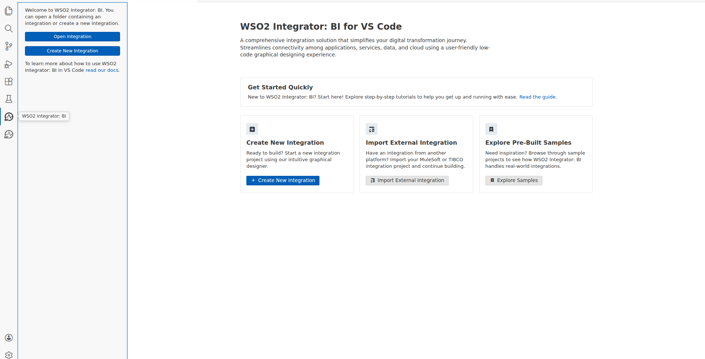
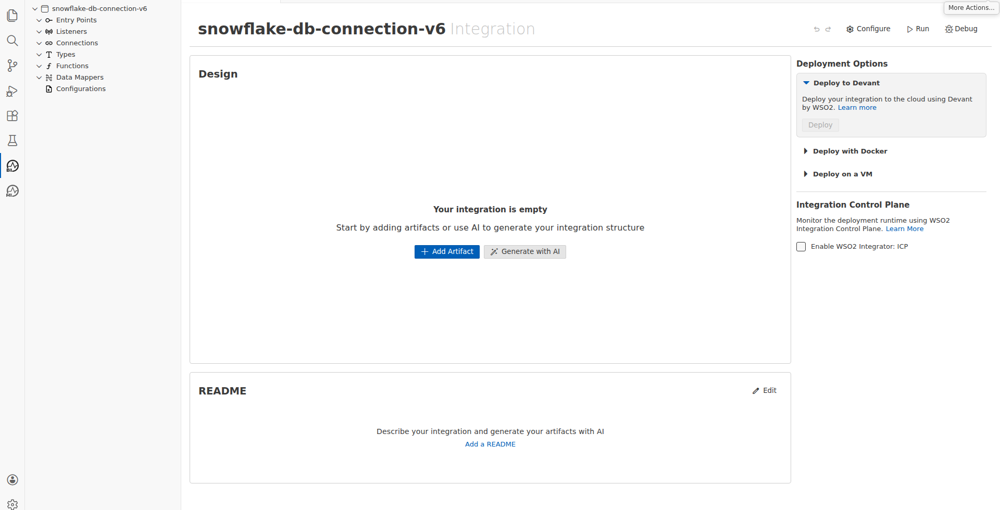
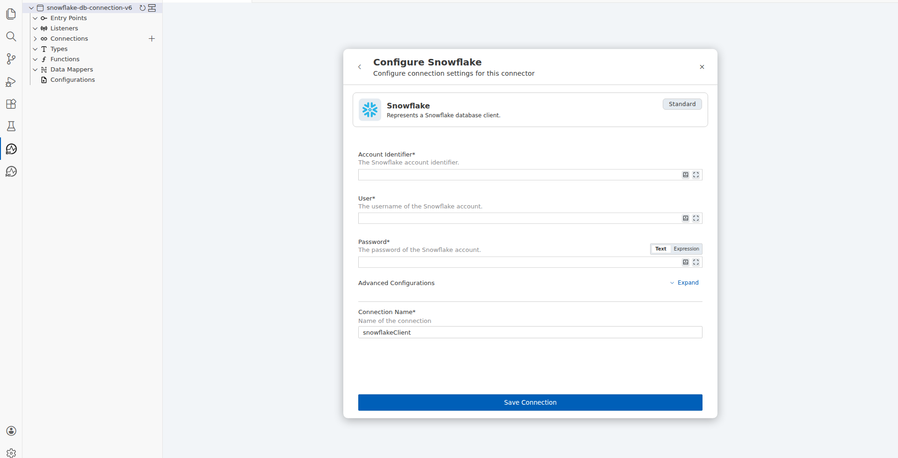
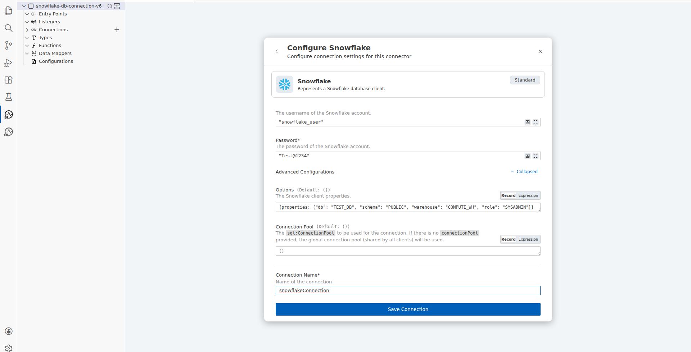
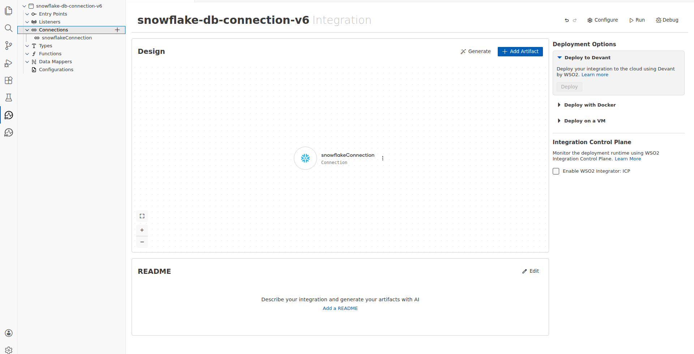
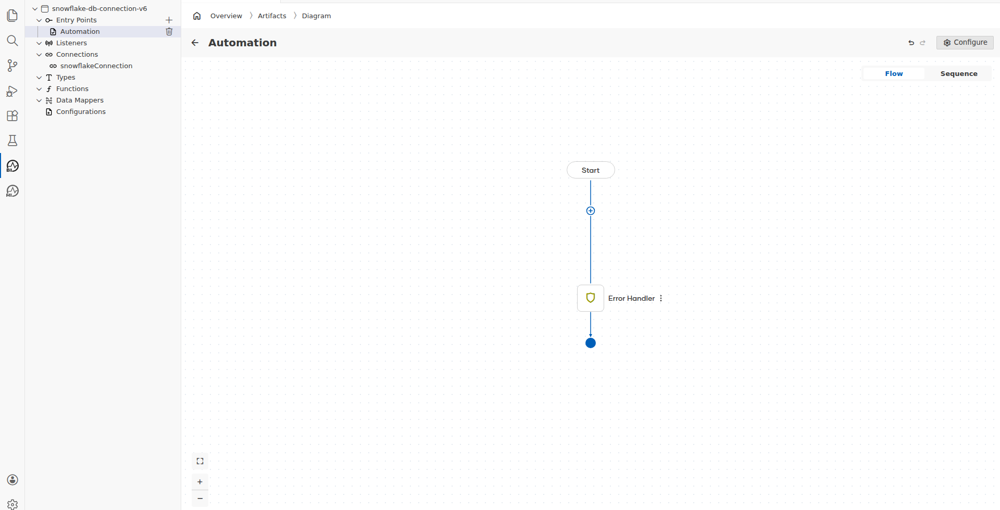
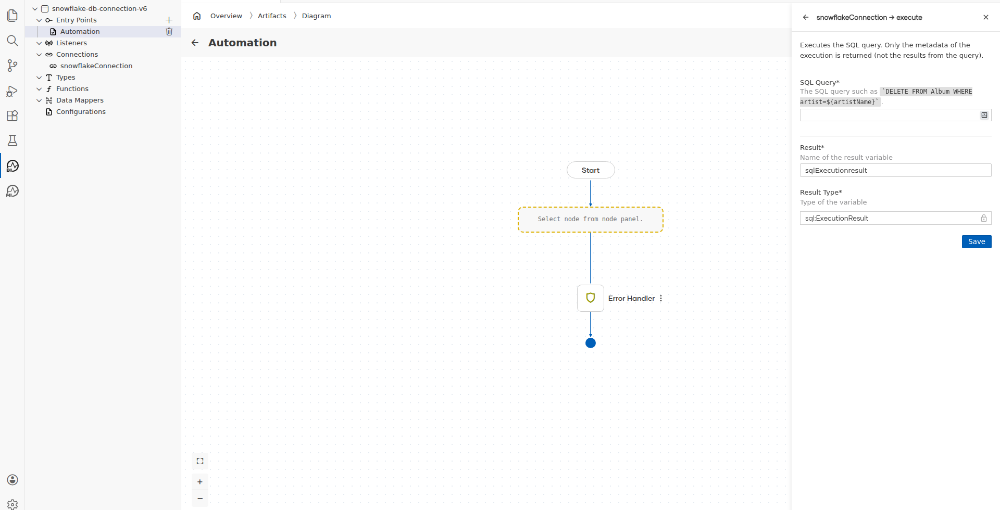
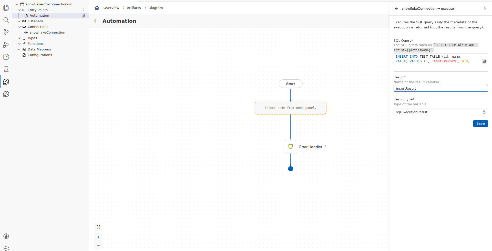
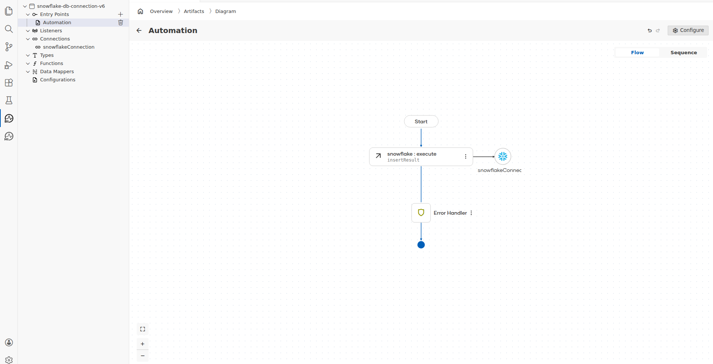

# Snowflake Connector Example

## What You'll Build

This integration demonstrates how to connect WSO2 Integrator to a Snowflake cloud data warehouse and insert a typed record into a Snowflake table. The workflow uses a Snowflake connection configured with account, database, schema, warehouse, and credential parameters, and calls the Execute operation to write a structured row to a target table using a parameterized SQL INSERT statement. The complete flow assembled on the canvas consists of an Automation entry point, a Snowflake Execute remote function call, and an End node.

**Operations used:**
- **execute** — executes a parameterized SQL statement (used here to perform an INSERT) against the configured Snowflake database, returning execution metadata such as affected row count

## Prerequisites

- A Snowflake account with an active virtual warehouse (e.g., COMPUTE_WH) and a target database and schema accessible via API.
- A Snowflake user with INSERT privileges on the target table and an assigned role (e.g., SYSADMIN).
- A Snowflake table (e.g., TEST_TABLE) with columns matching the insert fields: id (INTEGER), name (VARCHAR), value (FLOAT).

## Setting Up the Snowflake Integration

### Step 1: Open the WSO2 Integrator Panel
Click the WSO2 Integrator icon in the VS Code activity bar to open the extension panel. The panel displays options to open an existing integration or create a new one.

### Step 2: Create the Snowflake Integration
Click the "Create New Integration" button in the WSO2 Integrator panel and enter the name `snowflake-db-connection` to create a new integration project. The low-code canvas opens with an empty design area and a sidebar tree showing Entry Points, Listeners, Connections, Types, Functions, Data Mappers, and Configurations.

### Step 3: Explore the Low-Code Canvas Components
Review the available low-code building blocks visible in the canvas and sidebar — Entry Points (for Automation and HTTP Service triggers), Listeners, Connections (for adding named connectors), and flow step categories — to determine that the Automation pattern with a Snowflake connection is the correct integration approach for a database write operation.

## Adding the Snowflake Connector

### Step 4: Open the Connector Palette and Search for Snowflake
Click the Connections section in the sidebar to reveal the "Add Connection" button, then click it to open the connector palette. Type `Snowflake` in the search field and select the **Snowflake** connector (labelled `ballerinax / snowflake`) from the search results to open its configuration panel.

## Configuring the Snowflake Connection

### Step 5: Enter Snowflake Connection Parameters
Fill in all required Snowflake connection fields in the configuration panel, then expand the Advanced Configurations section to enter the Options record containing the database, schema, warehouse, and role properties.
- **Account Identifier**: `"my-account.snowflakecomputing.com"` — the fully qualified Snowflake account URL used to connect to the instance
- **User**: `"snowflake_user"` — the Snowflake login username for authentication
- **Password**: `"Test@1234"` — the password credential for the specified Snowflake user account
- **Options (properties)**: `{properties: {"db": "TEST_DB", "schema": "PUBLIC", "warehouse": "COMPUTE_WH", "role": "SYSADMIN"}}` — the Snowflake client properties record specifying the target database, schema, virtual warehouse, and access role
- **Connection Name**: `snowflakeConnection` — the logical name used to reference this connection in the integration flow

### Step 6: Save the Snowflake Connection
Click the "Save Connection" button to persist the Snowflake connection configuration. The connection is saved and `snowflakeConnection` appears both in the Connections sidebar tree and as a Connection node on the integration design canvas.

## Configuring the Snowflake Insert Operation

### Step 7: Add an Automation Entry Point to the Canvas
Click the Entry Points section in the sidebar to reveal the "Add Entry Point" button, click it, then select **Automation** from the artifact picker and click "Create" to add a scheduled Automation block as the entry point. The Automation flow canvas opens showing a Start node connected to an Error Handler and End node.

### Step 8: Open the Snowflake Execute Operation Panel
Click the "+" node in the Automation flow between Start and Error Handler to open the node selection panel. Expand the `snowflakeConnection` item under Connections to reveal available operations, then select **Execute** to open its configuration panel.
- **Operation**: `execute` — executes a parameterized SQL statement against Snowflake and returns execution metadata

### Step 9: Configure the Execute Operation Input Parameters
Fill in the SQL Query and result variable fields in the Execute operation configuration panel.
- **SQL Query**: `` `INSERT INTO TEST_TABLE (id, name, value) VALUES (1, 'test-record', 0.0)` `` — the parameterized SQL INSERT statement that writes a row with integer id, string name, and float value into the target Snowflake table
- **Result**: `insertResult` — the variable that captures the `sql:ExecutionResult` returned by the Execute operation
- **Result Type**: `sql:ExecutionResult` — the type of the result variable representing SQL execution metadata

### Step 10: Save the Execute Operation Configuration
Click "Save" to persist the Execute operation settings. The `snowflake : execute` node labelled `insertResult` is added to the Automation flow canvas, linked to the `snowflakeConnection` connector icon.

## Verifying the Snowflake Integration

### Step 11: Confirm the Complete Snowflake Flow on Canvas
Review the Automation flow canvas to confirm the complete connected flow is present: the **Start** node at the top, followed by the **snowflake : execute** remote function node (showing `insertResult` and linked to `snowflakeConnection`), followed by the **Error Handler** node, and terminating at the **End** node — all connected with directed edges and free of blocking error indicators.

