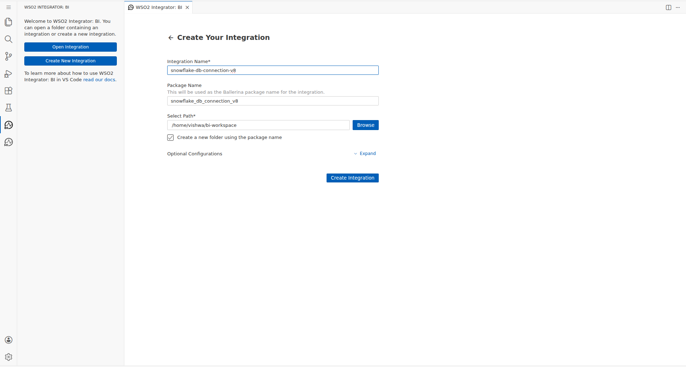
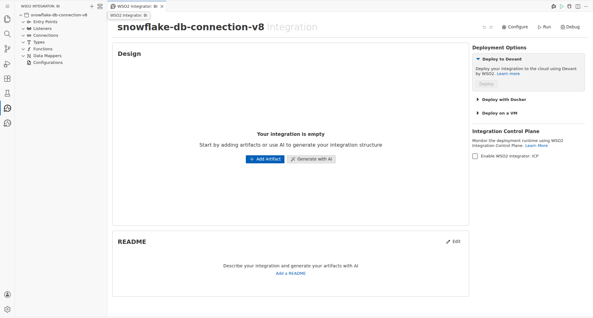
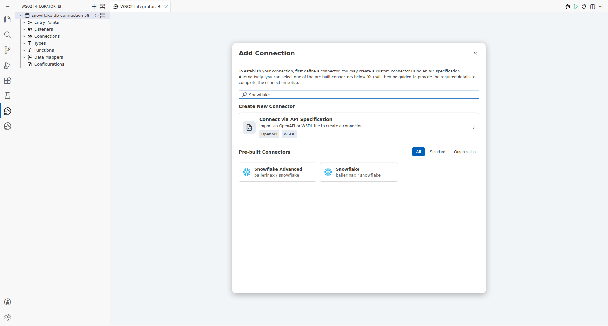
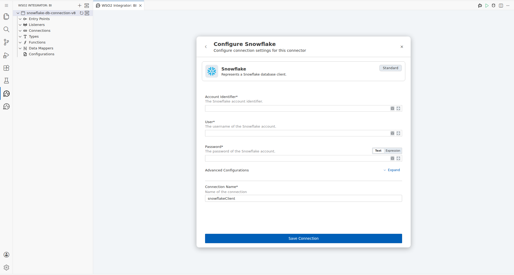
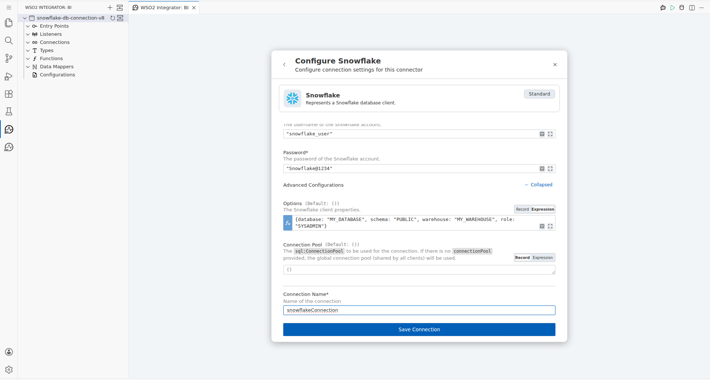
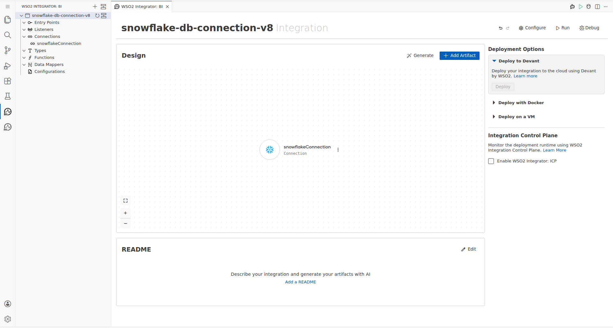
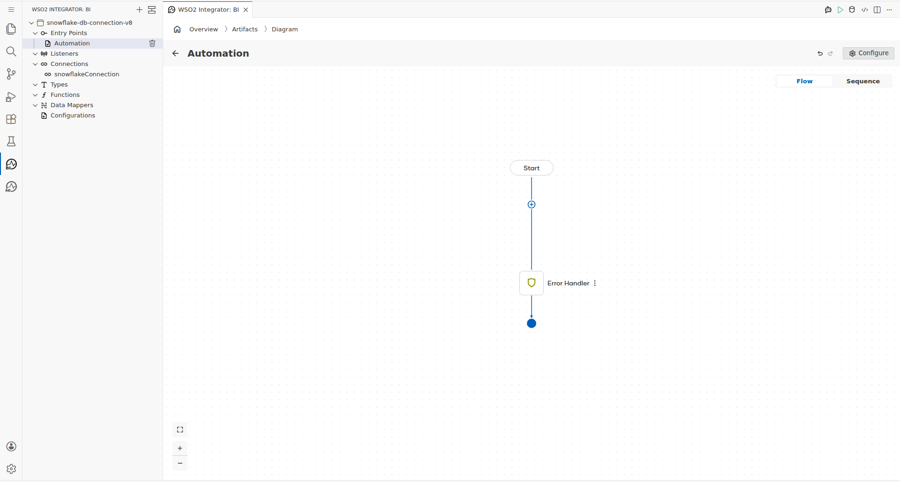
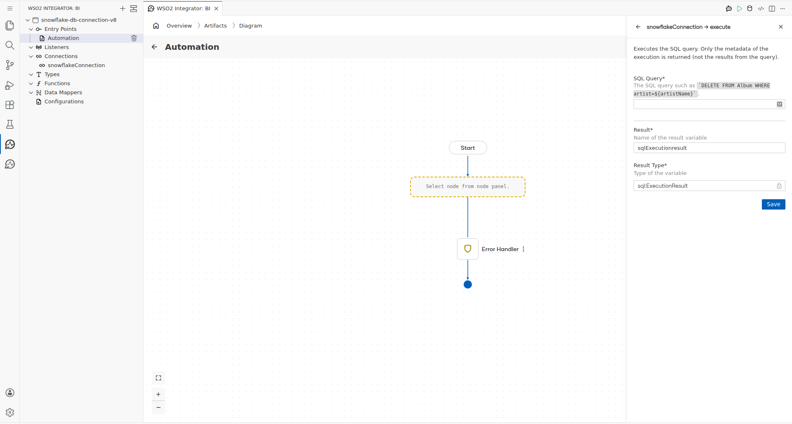
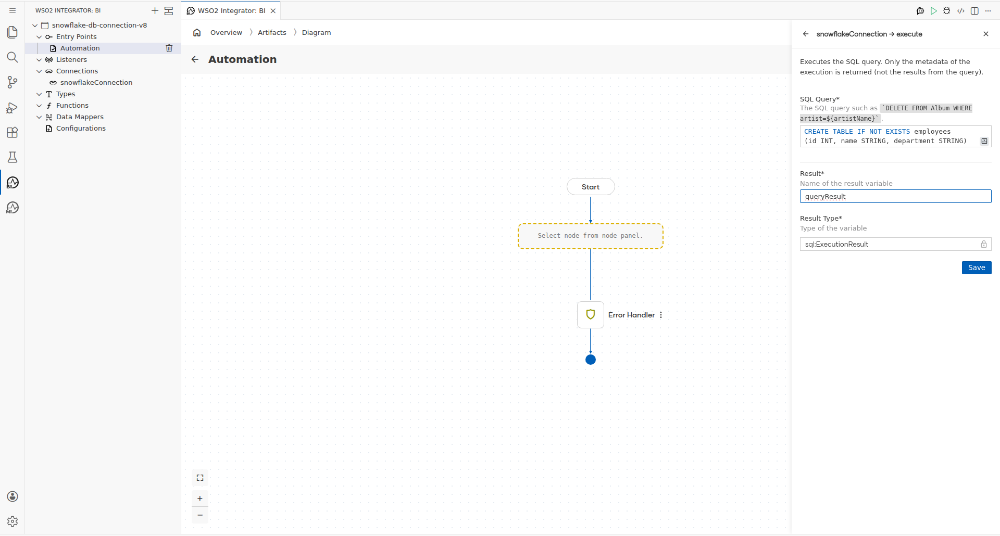
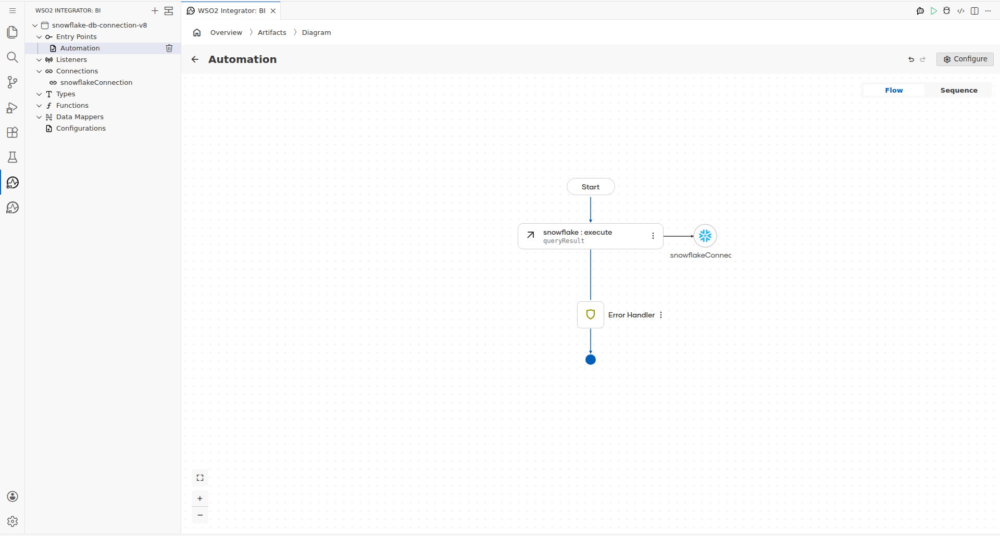

# Snowflake Connector Example

## Overview

This guide demonstrates how to integrate the **Snowflake connector** (`ballerinax/snowflake`) into a WSO2 Integrator: BI project using the low-code visual canvas. The integration connects to a Snowflake data warehouse and executes a raw SQL statement — specifically, a `CREATE TABLE` DDL command — using the `execute` operation. The result is captured as a `sql:ExecutionResult` variable for downstream use.

The integration is built entirely through the WSO2 Integrator: BI extension's graphical designer in Code-Server, without manually editing any Ballerina source files.

**Integration name:** `snowflake-db-connection-v8`
**Package name:** `snowflake_db_connection_v8`
**Entry point type:** Automation
**Operation used:** `snowflakeConnection → execute`
**SQL statement:** `CREATE TABLE IF NOT EXISTS employees (id INT, name STRING, department STRING)`

---

## Prerequisites

- **WSO2 Integrator: BI** extension installed in VS Code / Code-Server
- **Ballerina** Swan Lake runtime (2201.13.1 or later)
- A **Snowflake account** with the following details available:
  - Account Identifier (e.g., `my_org-my_account`)
  - Username and Password
  - Target Database, Schema, Warehouse, and Role
- The `bi-workspace` folder open in Code-Server (`~/bi-workspace`)
- Write access to the workspace directory

---

## Step-by-Step Guide

### 1. Create the Integration

Open the **WSO2 Integrator: BI** panel from the activity bar. Click the **Add Project** button (`+`) to create a new integration project.

In the **Create Integration** dialog, enter the integration name:

- **Integration Name:** `snowflake-db-connection-v8`

Click **Create** to generate the project. The low-code canvas opens automatically.



After creation, the empty canvas is displayed, ready for components to be added.



### 2. Add the Snowflake Connector

From the canvas, open the **component palette** and search for the Snowflake connector. In the search box, type `snowflake` to filter available connectors.



Click the **Snowflake** connector from the search results. The **Configure Snowflake** connection panel opens on the right side.



### 3. Configure the Snowflake Connection

Fill in the connection parameters in the configuration panel:

| Field | Value |
|---|---|
| **Account Identifier** | `"my_org-my_account"` |
| **User** | `"snowflake_user"` |
| **Password** | `"Snowflake@1234"` |
| **Connection Name** | `snowflakeConnection` |

For the additional Snowflake options (database, schema, warehouse, role), expand the **Advanced Configurations** section and switch the **Options** field to **Expression** mode. Enter the full `snowflake:Options` record:

```ballerina
{database: "MY_DATABASE", schema: "PUBLIC", warehouse: "MY_WAREHOUSE", role: "SYSADMIN"}
```



Click **Save** to persist the connection. The `snowflakeConnection` entry appears in the left sidebar under **Connections** and is referenced on the canvas.



### 4. Add an Automation Entry Point

In the left sidebar, click the **+** button next to **Entry Points** and select **Automation**. This adds a new manually-invokable flow to the integration.

The Automation flow canvas appears with a **Start** node and an **Error Handler** node.



### 5. Add the Execute Operation

Click the **+** (empty node) placeholder in the Automation flow between Start and Error Handler. The node selection panel opens.

Under the **Connections** section, click **snowflakeConnection** to expand its available operations:

- Query
- Query Row
- Execute
- Batch Execute
- Call
- Close

Select **Execute**. The `snowflakeConnection → execute` configuration panel opens on the right.



---

## Connection Configuration

The Snowflake connector connection (`snowflakeConnection`) is configured with the following parameters:

| Parameter | Value | Notes |
|---|---|---|
| **Account Identifier** | `"my_org-my_account"` | Format: `<org>-<account>` |
| **User** | `"snowflake_user"` | Snowflake login username |
| **Password** | `"Snowflake@1234"` | Snowflake login password |
| **Database** | `"MY_DATABASE"` | Target database in Snowflake |
| **Schema** | `"PUBLIC"` | Target schema within the database |
| **Warehouse** | `"MY_WAREHOUSE"` | Compute warehouse to use |
| **Role** | `"SYSADMIN"` | Role granting DDL privileges |
| **Connection Name** | `snowflakeConnection` | Canvas identifier for this connection |

The `database`, `schema`, `warehouse`, and `role` fields are provided as a `snowflake:Options` record expression in the **Advanced Configurations → Options** field (Expression mode):

```ballerina
{database: "MY_DATABASE", schema: "PUBLIC", warehouse: "MY_WAREHOUSE", role: "SYSADMIN"}
```

---

## Operation Details

The `execute` operation runs a raw SQL statement against the configured Snowflake connection. Only the execution metadata is returned — not result rows.

### Configuration

| Field | Value |
|---|---|
| **Operation** | `snowflakeConnection → execute` |
| **SQL Query** | `` `CREATE TABLE IF NOT EXISTS employees (id INT, name STRING, department STRING)` `` |
| **Result Variable** | `queryResult` |
| **Result Type** | `sql:ExecutionResult` |

The SQL query uses Ballerina's backtick-delimited `sql:ParameterizedQuery` syntax, which supports safe interpolation of runtime values using `${}` placeholders.

Fill in the execute operation form with the SQL query and result variable name before saving:



Click **Save** to add the execute node to the Automation flow canvas.


---

## Complete Flow

The completed Automation flow executes the following sequence:

1. **Start** — the Automation entry point is triggered
2. **snowflake : execute** — runs the `CREATE TABLE IF NOT EXISTS employees` DDL statement against `snowflakeConnection`, storing metadata in `queryResult`
3. **Error Handler** — catches any runtime errors during execution
4. **End** — the Automation completes

The `snowflakeConnection` is visually linked to the execute node on the canvas, confirming the connector binding.



**Left sidebar state after completion:**

- `Entry Points` → `Automation` (main)
- `Connections` → `snowflakeConnection`
- `Types`, `Functions`, `Data Mappers`, `Configurations` — empty (default)

---

## Summary

This guide walked through the complete process of building a Snowflake connector integration using the WSO2 Integrator: BI low-code canvas:

1. **Created** a new integration project (`snowflake-db-connection-v8`) in the `bi-workspace`
2. **Added** the `ballerinax/snowflake` connector via the component palette
3. **Configured** the connection with Account Identifier, User, Password, and a `snowflake:Options` record for Database, Schema, Warehouse, and Role — named `snowflakeConnection`
4. **Added** an Automation entry point to define the integration flow
5. **Inserted** the `execute` operation, providing a `CREATE TABLE` SQL statement as a `sql:ParameterizedQuery` and storing the result in `queryResult` as `sql:ExecutionResult`
6. **Verified** the complete flow diagram: Start → `snowflake : execute` → Error Handler → End

The integration is ready for further extension — for example, adding logging, conditional branching on the `queryResult`, or chaining additional Snowflake operations within the same Automation flow.
