# Kafka Consumer Integration Creation Guide

This guide documents the step-by-step workflow for creating a **Kafka Consumer Integration** using the WSO2 Integrator: BI low-code interface inside a code-server VS Code environment. The integration sets up a Kafka listener that consumes messages from a topic and logs each received message.

---

## Configured Parameters

| Parameter | Value | Description |
|---|---|---|
| **Integration Name** | `kafka-consumer-integration` | Ballerina project name created via WSO2 Integrator: BI |
| **Bootstrap Servers** | `localhost:9092` | Kafka broker address the listener connects to |
| **Topic Name** | `sample-topic` | Kafka topic the consumer subscribes to |
| **Listener Name** | `kafkaListener` | Identifier for the `kafka:Listener` instance in the generated Ballerina code |
| **Event Handler** | `onConsumerRecord` | Kafka service method invoked when a record arrives |
| **Caller Option** | Enabled | Enables the `kafka:Caller` parameter for manual offset management |
| **Log Message** | `"Received Kafka message: " + payload.toString()` | Message logged for each consumed Kafka record |

---

## Prerequisites

- **code-server** running on `http://localhost:8080` with `--auth none`
- **WSO2 Integrator: BI** extension installed in code-server
- **Ballerina 2201.12.0** (Swan Lake) available in the environment
- Network access to Ballerina Central (for the `ballerina/log` module download)

---

## Phase 1 — Integration Creation

### Step 1: Open WSO2 Integrator: BI

Navigate to `http://localhost:8080` in a browser. In the VS Code activity bar, click the WSO2 Integrator: BI icon to open the extension panel. From the welcome screen, click **Create New Integration**.

Enter `kafka-consumer-integration` as the integration name and confirm the project location. The extension scaffolds a new Ballerina project and opens the Integration Designer canvas.

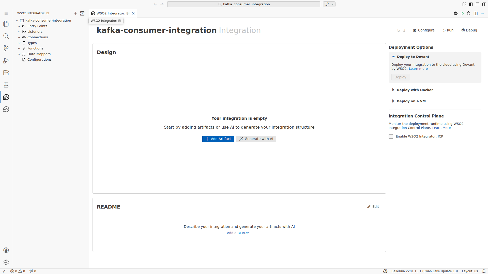

---

## Phase 2 — Component Selection

### Step 2: Open the Component Palette

With the empty Integration Designer canvas visible, click the **+ Add Artifact** button (or use the Artifacts panel) to open the component palette. The palette lists all available integration component types including **Event Integration**, **HTTP Service**, **Automation**, and more.

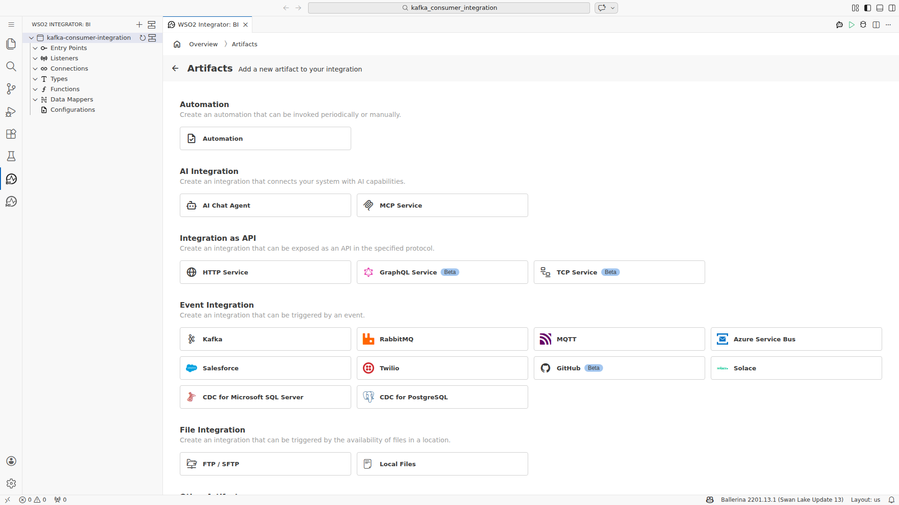

### Step 3: Locate the Kafka Consumer

Expand the **Event Integration** section in the component palette. The **Kafka** connector appears as a card within this section, representing the event-driven Kafka consumer pattern powered by `kafka:Listener` and `kafka:Service`.


### Step 4: Add Kafka Consumer to Canvas

Click the **Kafka** card to begin adding it to the integration canvas. A **Kafka Event Integration** configuration form opens immediately, ready for connection parameter input.

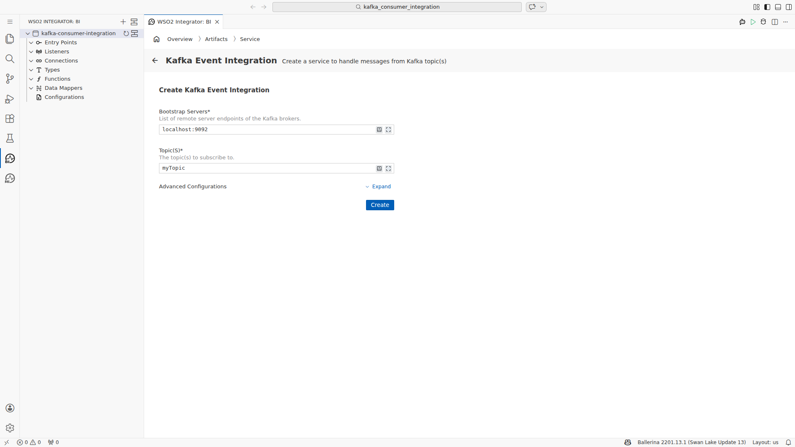

---

## Phase 3 — Connection Configuration

### Step 5: Set Bootstrap Servers and Topic

Fill in the connection parameters in the Kafka Event Integration form:

- **Bootstrap Servers**: `localhost:9092`
- **Topic(s)**: `sample-topic`

These fields define which Kafka broker to connect to and which topic to subscribe. The Bootstrap Servers field accepts a comma-separated list of `host:port` entries for multi-broker clusters.

> **Note:** Click the form heading or a neutral area between fields after filling Bootstrap Servers before moving to the Topic field. This dismisses the auto-suggest helper panel and prevents input from landing in the wrong field.

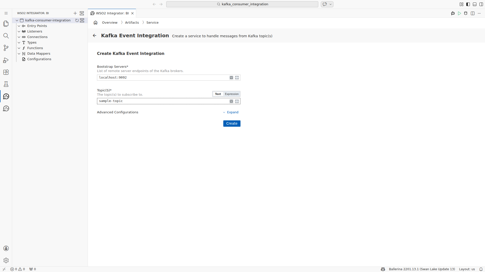

### Step 6: Configure Advanced Properties — Listener Name

Expand the **Advanced Configurations** section of the form. Set the **Listener Name** field to `kafkaListener`. This is the variable name used for the `kafka:Listener` instance in the generated Ballerina source code.

Click **Save** to apply the connection settings. The Service Designer view opens showing the listener and subscribed topics as chips.

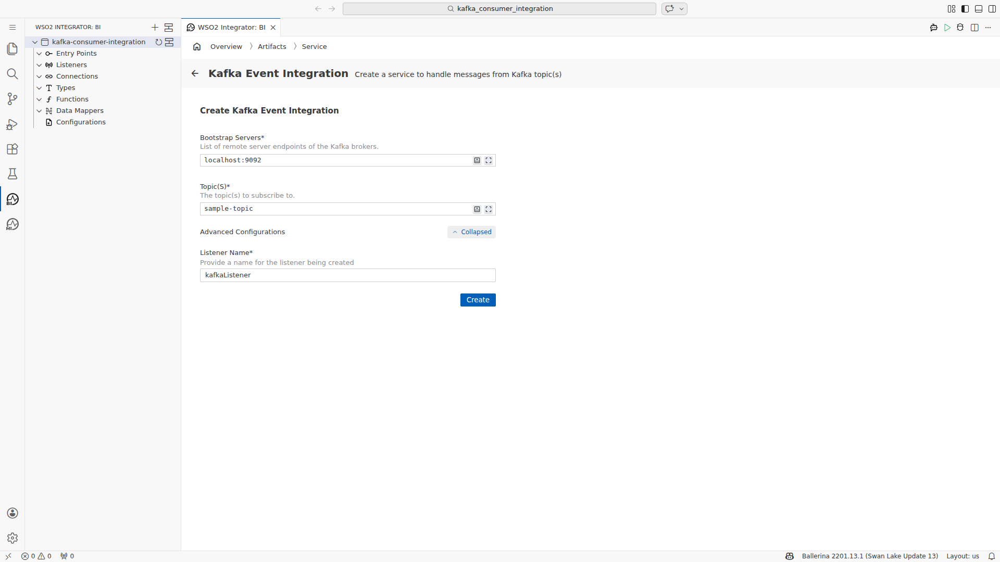

---

## Phase 4 — Message Processing Setup

### Step 7: Add the Event Handler

In the Service Designer, the configured listener (`kafkaListener`) and topic (`sample-topic`) are displayed. Click **+ Add Handler** to attach an event handler function to the Kafka service.

The handler options dialog appears. Select **onConsumerRecord** — the standard Kafka service method that is invoked each time a batch of records arrives on the subscribed topic.

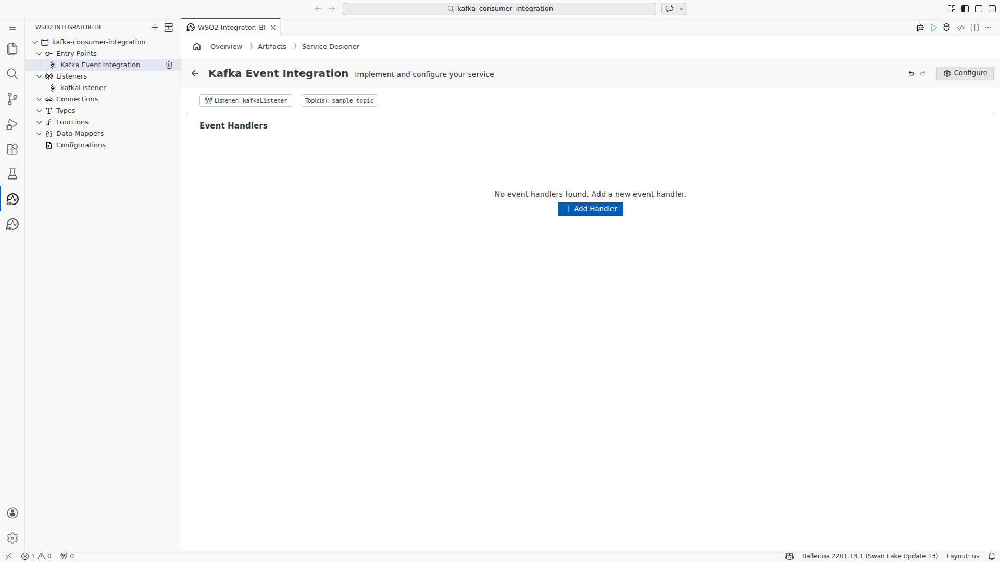

### Step 8: Review the Handler Flow

After selecting `onConsumerRecord`, the designer generates the event handler flow. The canvas shows the flow structure:

```
Start → ⊕ (junction) → Error Handler → End
```

This skeleton represents the Ballerina service method body ready for logic nodes to be inserted.

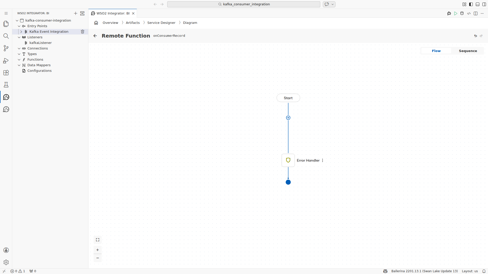

### Step 9: Enable the Caller Parameter

Before adding processing logic, open the **Message Handler Configuration** panel (click the handler name or configuration icon). Enable the **Caller** checkbox.

Enabling `Caller` adds a `kafka:Caller` parameter to the `onConsumerRecord` method signature, allowing the integration to manually acknowledge or commit offsets — useful for at-least-once delivery guarantees.

Click **Save** to apply.

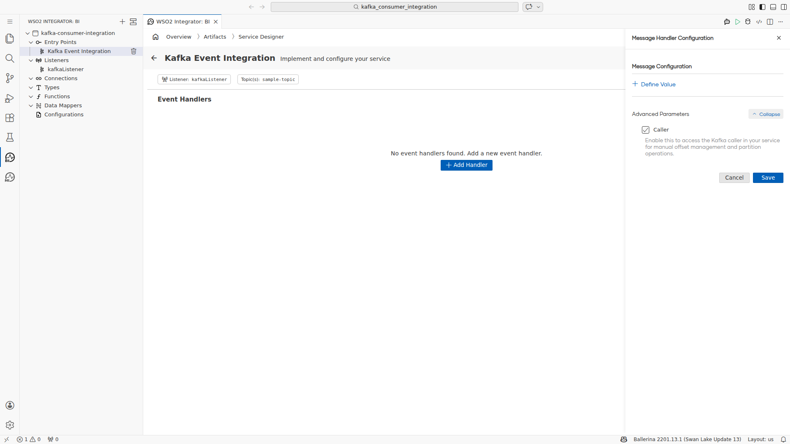

### Step 10: Add Log Info Node

Click the **+** button on the flow canvas between Start and the Error Handler to insert a processing node. Select **Log** → **Log Info** from the node palette.

> **Note:** Selecting Log Info triggers an automatic download of `ballerina/log:2.10.0` from Ballerina Central. Wait approximately 5 seconds for the module pull to complete before the configuration form appears.

In the Log Info configuration form, set the message expression to:

```ballerina
"Received Kafka message: " + payload.toString()
```

Click **Save**. The node appears in the flow diagram between Start and Error Handler.

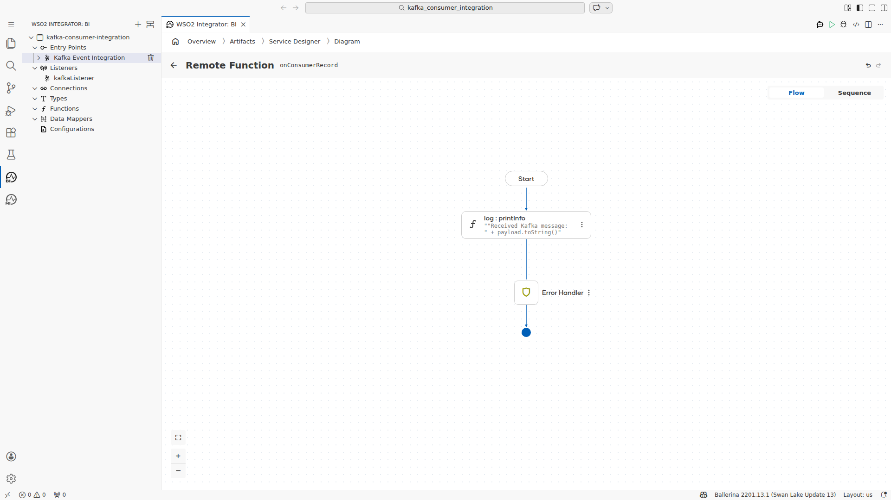

---

## Phase 5 — Final Verification

### Step 11: Check Status Bar

Return to the Service Designer view. The extension header shows **Event Handler: onConsumerRecord** and the VS Code status bar at the bottom confirms:

- **Errors: 0**
- **Warnings: 0**

This confirms the generated Ballerina code is syntactically and semantically valid.

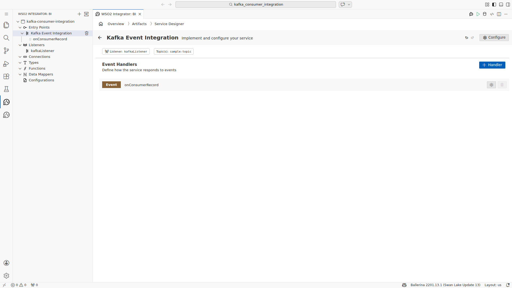

### Step 12: Inspect Integration Overview

Open the **Integration Overview** from the WSO2 Integrator: BI panel to see the full integration topology. The canvas renders:

```
kafkaListener (kafka:Listener) ──→ kafka:Service ──→ onConsumerRecord
```

This confirms that the Kafka listener is correctly connected to the service, which exposes the `onConsumerRecord` handler as the entry point for consumed messages.

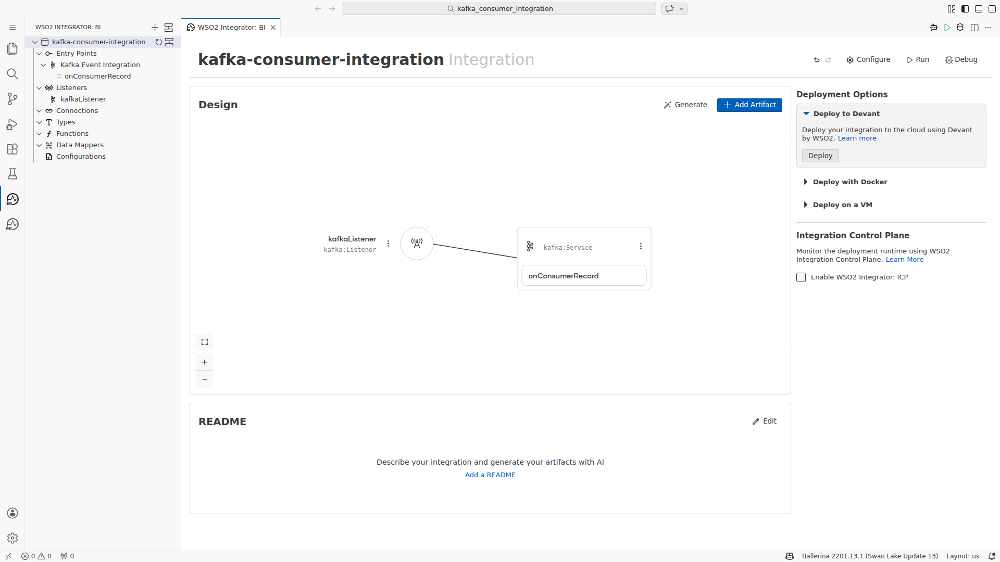

---

## Generated Integration Structure

The low-code actions above produce the following Ballerina source structure (auto-generated by WSO2 Integrator: BI):

```ballerina
import ballerina/log;
import ballerinax/kafka;

kafka:Listener kafkaListener = check new ({
    bootstrapServers: "localhost:9092"
});

service kafka:Service on kafkaListener {
    remote function onConsumerRecord(kafka:Caller caller,
                                     kafka:AnydataConsumerRecord[] records) returns error? {
        foreach var record in records {
            anydata payload = record.value;
            log:printInfo("Received Kafka message: " + payload.toString());
        }
    }
}
```

> The exact generated source can be found in `main.bal` within the `kafka-consumer-integration` Ballerina project.

---

## Key Design Decisions

| Decision | Rationale |
|---|---|
| Single broker (`localhost:9092`) | Development/testing setup; extend with comma-separated brokers for production |
| `onConsumerRecord` handler | Standard Kafka service method for batch record consumption in Ballerina |
| Caller parameter enabled | Allows manual offset commit for reliable at-least-once message processing |
| `log:printInfo` for message handling | Simple verification of message receipt; replace with actual business logic |
| Listener Name `kafkaListener` | Descriptive variable name; used across service binding and Ballerina code |

---

## Troubleshooting

| Issue | Cause | Resolution |
|---|---|---|
| Text typed in wrong field | Bootstrap Servers auto-suggest overlay intercepts clicks on Topic field | Click the form heading to dismiss the helper panel before clicking the next field |
| Click timeout on nested iframe elements | WSO2 BI renders in double-nested iframes; overlays block pointer events | Use `page.frames()` traversal in `browser_run_code` to fill fields directly in the inner frame |
| Log module not found immediately | `ballerina/log:2.10.0` is pulled from Ballerina Central on first use | Wait ~5 seconds after selecting Log Info for the module download to complete |
| Snapshot returns empty content | UI transition in progress after an action | Take a fresh `browser_snapshot` before acting; retry after a short wait |

---

## Run Statistics

| Metric | Value |
|---|---|
| **Start Time** | `2026-03-03T04:58:03Z` |
| **End Time** | `2026-03-03T05:09:46Z` |
| **Total Duration** | ~11 min 43 sec |
| **Screenshots Captured** | 12 |
| **Stages Completed** | 14 of 14 |
| **Final Status** | ✅ 0 errors, 0 warnings |
