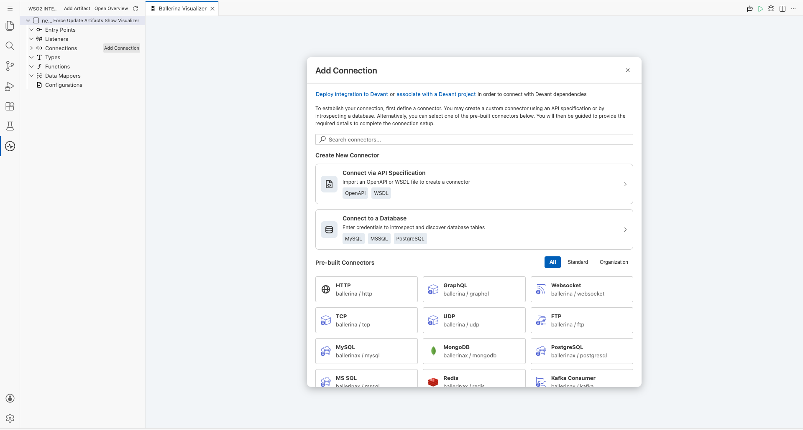
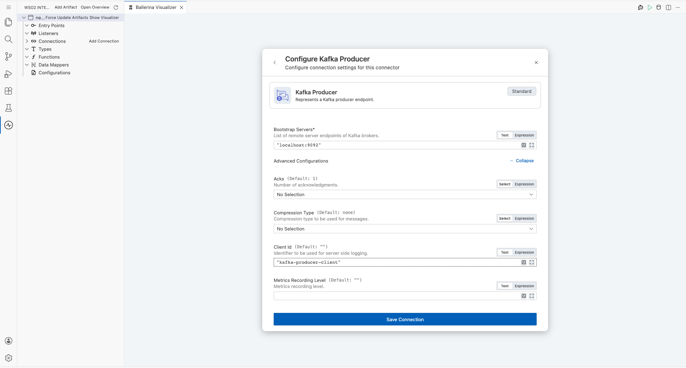
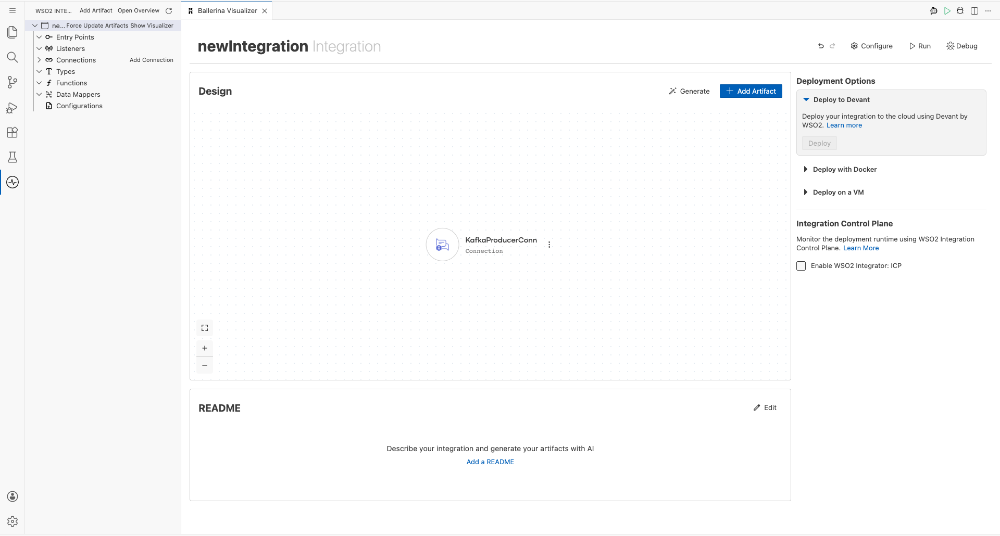
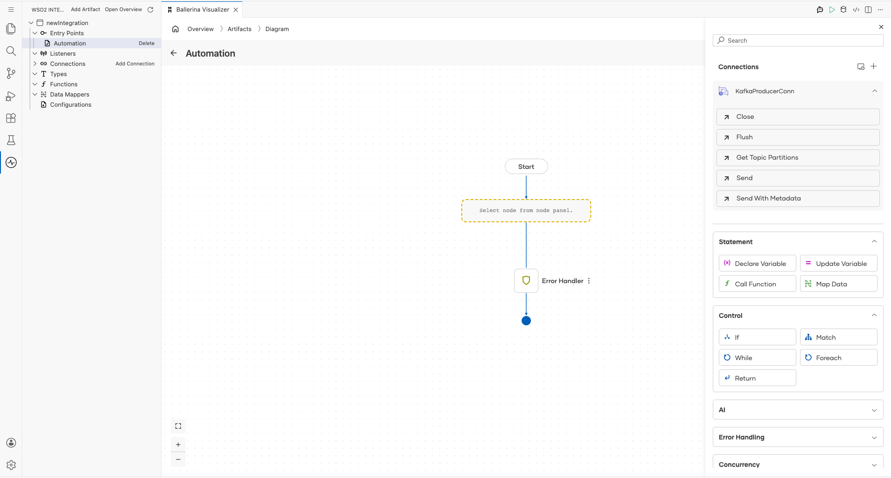
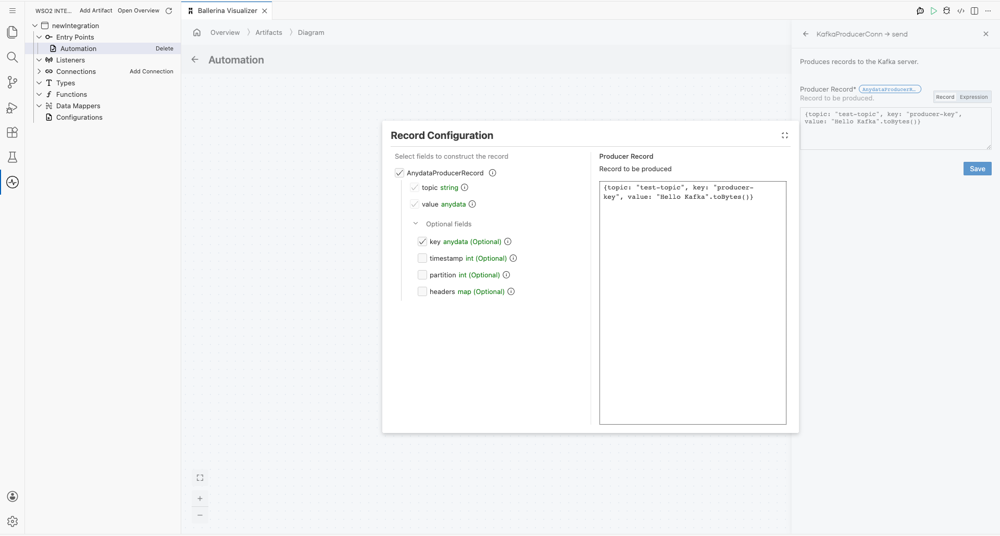
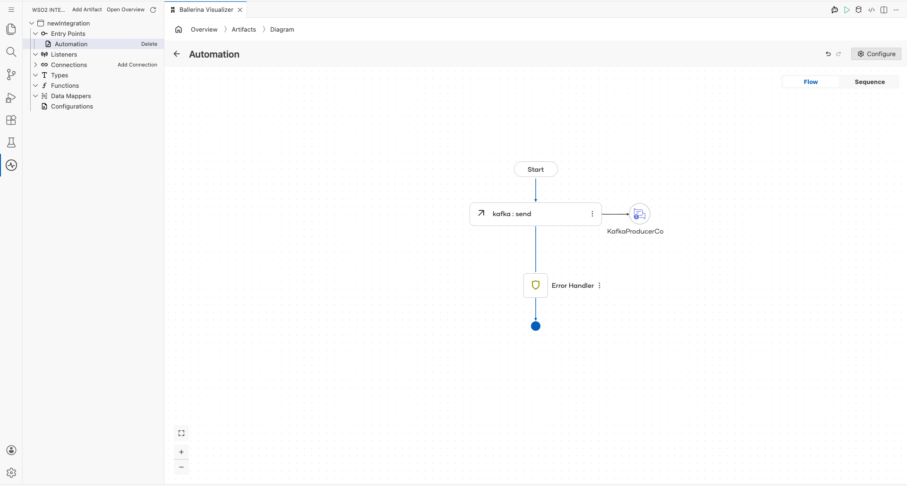

# Kafka Producer Connector Example

## What You'll Build

This integration demonstrates how to configure a Kafka Producer connector in WSO2 Integrator's low-code canvas and publish a message to a Kafka topic using the Send operation. The workflow assembles an Automation trigger that fires on a configured interval, calls the Kafka Producer's Send remote function with a byte-array payload, and completes the flow through the End node. By the end of this guide you will have a fully connected Automation → Send → End flow ready to publish messages to `test-topic` on a Kafka broker.

**Operations used:**
- **Send** — Publishes a byte-array message payload to a specified Kafka topic using the configured Kafka Producer connection.

## Prerequisites

- A running Apache Kafka broker accessible at a configured bootstrap server address.
- The `test-topic` Kafka topic must exist on the broker before running this integration.

## Setting Up the Kafka Producer Integration

> **New to WSO2 Integrator?** Follow the [Create a New Integration Project](../getting-started/create-integration.md) guide to set up your project first, then return here to add the connector.

## Adding the Kafka Connector

### Step 1: Open the Connector Palette
In the WSO2 Integrator sidebar, click on the **Connections** section to expand it, then click the **"+ Add Connection"** button (or the "+" icon next to the Connections heading) to open the connector search palette. The palette displays a search field and a scrollable grid of all available connectors — including pre-built connectors for messaging, databases, cloud services, and more.

### Step 2: Search for and Select the Kafka Connector
Type `Kafka` in the palette search box. When the filtered results appear, you will see both **Kafka Consumer** and **Kafka Producer** connector cards. Click the **Kafka Producer** card (`ballerinax / kafka`) to open the Kafka connection configuration form. Do not click Save yet — proceed to fill all parameters first.

## Configuring the Kafka Producer Connection

### Step 3: Enter Kafka Producer Connection Parameters
Fill in all required fields in the Kafka connection configuration form with the values below. Expand the **Advanced Configurations** section to access the Client Id field, then click **Save Connection** to persist the connection.

- **connectionName**: `KafkaProducerConn` — a friendly display name that identifies this connection on the canvas
- **bootstrapServers**: `"kafka-broker:9092"` — the hostname and port of the Kafka broker the producer connects to
- **clientId**: `"kafka-producer-client"` — a unique string identifier assigned to this producer instance for logging and metrics

### Step 4: Confirm the Kafka Connection Appears on the Canvas
After clicking **Save Connection**, verify that the `KafkaProducerConn` entry is now visible as a Connection node on the low-code canvas, confirming the connection was persisted successfully.

## Configuring the Kafka Producer Send Operation

### Step 5: Add an Automation Entry Point
On the low-code canvas, click **"+ Add Artifact"** and select **Automation** from the artifact picker. Click **Create** to confirm. The Automation entry point (labelled `main`) appears in the sidebar under Entry Points, and the canvas switches to the Automation flow diagram view showing a **Start** node with a dashed placeholder step below it.

### Step 6: Open the Add Step Panel and Expand the Kafka Connection Node
Inside the Automation flow body, click the **"+"** placeholder node (the dashed "Select node from node panel" box) between the Start and Error Handler nodes. The node panel opens on the right side, showing a **Connections** section at the top. Click the **`KafkaProducerConn`** entry in the Connections section to expand it and reveal all available Kafka Producer operations.

### Step 7: Select the Send Operation and Configure Its Values
Click the **Send** operation from the expanded `KafkaProducerConn` operations list. The **Record Configuration** panel opens, showing the `AnydataProducerRecord` fields. Enable the optional **key** field by checking its checkbox under Optional fields, then populate all fields in the Producer Record editor with the values below, and click **Save**.

- **topic**: `"test-topic"` — the Kafka topic to which the message will be published
- **value**: `"Hello Kafka".toBytes()` — the message payload serialized as a byte array
- **key**: `"producer-key"` — an optional string key used for Kafka partition routing

### Step 8: Verify the Completed Integration Flow
After saving the Send operation, the canvas displays the complete flow — **Start → kafka:send (KafkaProducerConn) → Error Handler → End** — with all nodes connected by arrows. The `KafkaProducerCo...` connection icon is shown linked to the `kafka : send` step node, confirming the Kafka Producer connection is wired correctly into the automation flow.

