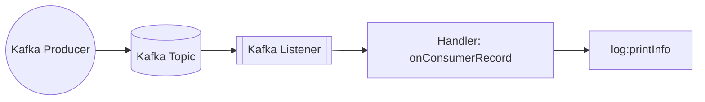
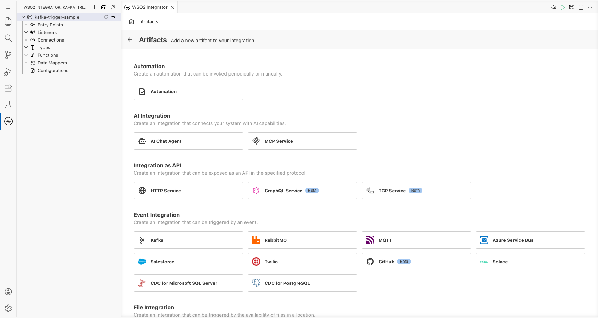
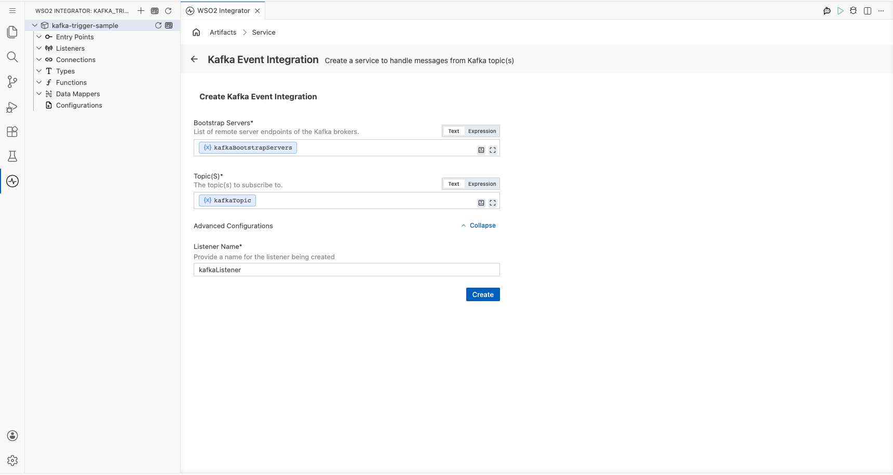
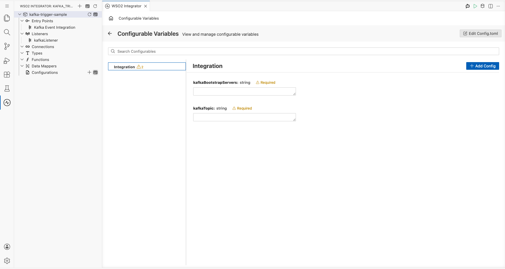
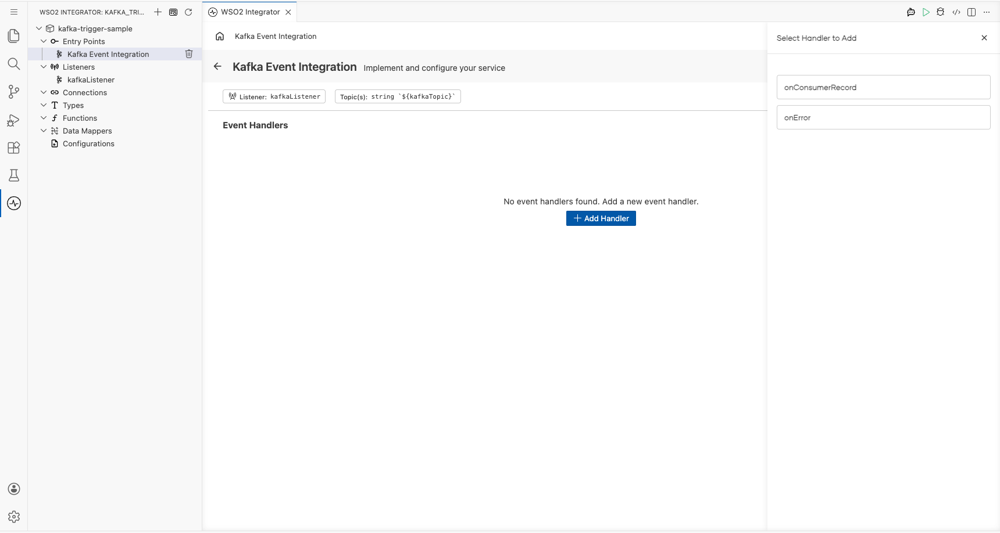
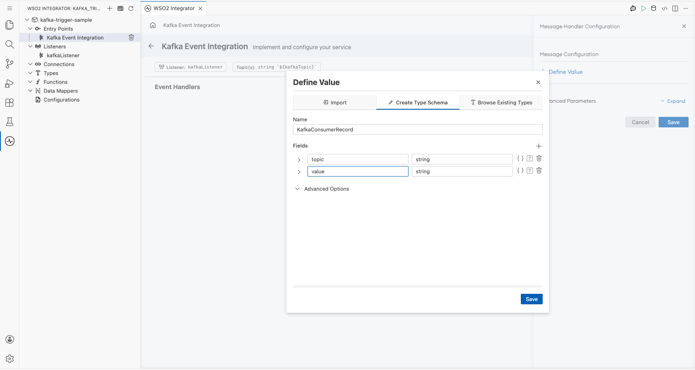
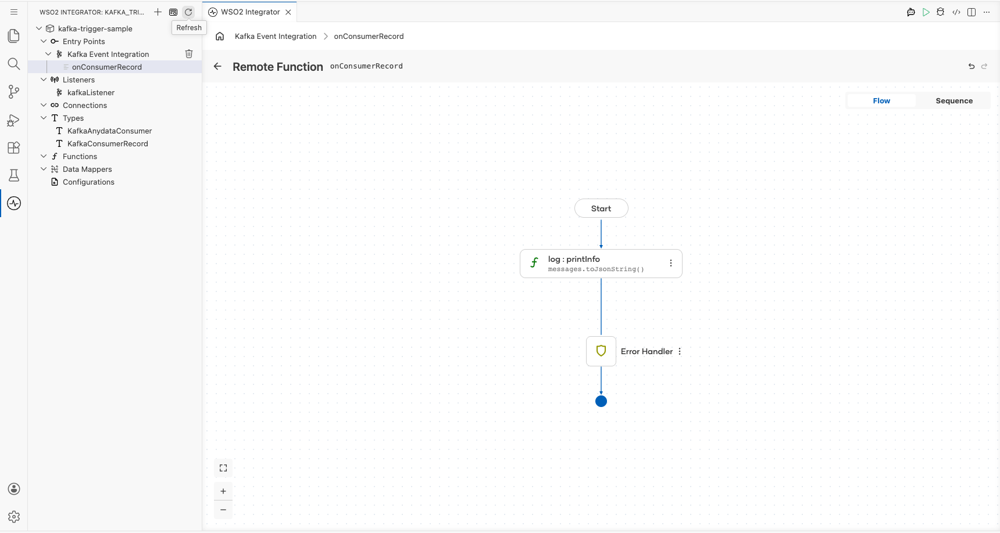
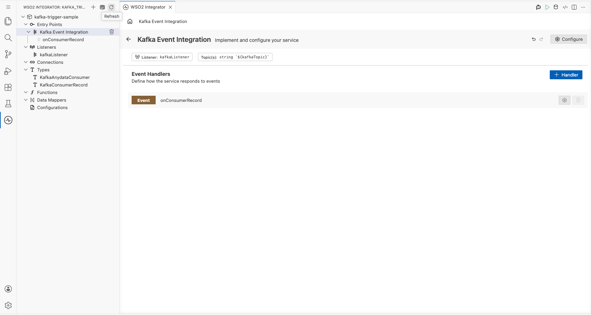

# Example

## What you'll build

This integration listens for messages published to a Kafka topic by a Kafka producer and receives them through a `ballerinax/kafka` trigger listener bound to a configurable bootstrap server and topic. When a new consumer record arrives, the `onConsumerRecord` handler fires and logs the full payload to the console as a JSON string using `log:printInfo(messages.toJsonString())`. The end-to-end flow—Kafka listener → `onConsumerRecord` handler → log—is assembled entirely on the WSO2 Integrator low-code canvas.

## Architecture

## Prerequisites

- A running Apache Kafka broker accessible at the configured bootstrap server address.
- A Kafka topic created and ready to receive messages (e.g., `test-topic`).
- A Kafka producer or CLI tool such as `kafka-console-producer` available to publish test messages.

## Setting up the Kafka integration

> **New to WSO2 Integrator?** Follow the [Create a New Integration](../../../../develop/create-integrations/create-new-integration.md) guide to set up your integration first, then return here to add the trigger.

## Adding the Kafka trigger

### Step 1: Open the Artifacts palette and select the Kafka trigger

1. Select **+ Add Artifact** on the canvas to open the Artifacts palette.
2. In the **Event Integration** category, locate and select the **Kafka** card.

## Configuring the Kafka listener

### Step 2: Bind Kafka listener parameters to configuration variables

For each required listener parameter field, open the inline helper, select the **Configurables** tab, select **+ New Configurable**, enter a camelCase variable name and the appropriate type (`configurable string`), and select **Save**—the value is automatically injected into the field. Repeat for every field listed below:

- **Bootstrap Servers** : The Kafka broker address(es) the listener connects to. Bound to a `configurable string` variable.
- **Topic(s)** : The Kafka topic name(s) the listener subscribes to for incoming messages. Bound to a `configurable string` variable.

Leave the **Listener Name** field under **Advanced Configurations** at its default value (e.g., `kafkaListener`). For enum-typed fields, select the appropriate value directly from the dropdown—no configurable variable is needed. For boolean fields, select the value directly from the dropdown.

### Step 3: Select Create to register the listener and open the Service view

Select **Create** at the bottom of the trigger configuration form. The Kafka listener chip is auto-created and appears in the Service view—no separate listener setup step is required.

### Step 4: Set actual values for your configurations

Before running the integration, provide real values for the configurations you created. In the left panel of WSO2 Integrator, select **Configurations** (at the bottom of the project tree, under Data Mappers). This opens the Configurations panel where you can set a value for each configuration:

- **kafkaBootstrapServers** (string) : The hostname and port of your Kafka broker.
- **kafkaTopic** (string) : The name of the Kafka topic to subscribe to, e.g. `test-topic`.

## Handling Kafka events

### Step 5: Open the Add Handler side panel

1. In the Service view, select **+ Add Handler** on the right of the Event Handlers section.
2. The **Select Handler to Add** side panel opens, listing the available Kafka handler options including `onConsumerRecord` and `onError`.

### Step 6: Select the onConsumerRecord handler and define the message payload type

1. In the side panel, select **onConsumerRecord** to open the Message Handler Configuration panel.
2. In the **Message Configuration** field, select **Define Value**—the Define Value modal opens.
3. Select the **Create Type Schema** tab and enter the unique PascalCase record name `KafkaConsumerRecord` in the **Name** field.
4. Select the **+** icon next to **Fields** to add each payload field, entering a field name and a type for every field—for example: `topic` (`string`) and `value` (`string`).
5. Select **Save** to create the record type and bind it to the handler.

### Step 7: Save the handler configuration and add a log statement to the flow

1. Select **Save** on the Message Handler Configuration panel—the flow canvas for the `onConsumerRecord` handler opens.
2. In the handler body, add a `log:printInfo(messages.toJsonString())` step using the canvas.
3. Verify the `log:printInfo` node appears between Start and Error Handler on the canvas.

### Step 8: Confirm the handler is registered in the Service view

Select the back arrow in the canvas header (or re-select the Kafka trigger service in the project tree) to return to the Service view. The Event Handlers list now shows the registered `Event onConsumerRecord` handler row.

## Running the integration

### Step 9: Run the integration and trigger a test Kafka event

1. In the WSO2 Integrator panel, select **Run** to start the integration and wait for the Kafka listener to connect to the broker.
2. Trigger a test consumer record using one of the following methods:
   - A separate WSO2 Integrator **Kafka Producer** integration assembled from the same low-code canvas (recommended—use the `ballerinax/kafka` producer template to publish a message to the same topic).
   - The Kafka CLI producer: run `kafka-console-producer.sh` targeting your broker and topic, then enter a message and press Enter.
   - The Kafka web console (e.g., Confluent Control Center or Kafdrop) if available in your environment—navigate to the topic and produce a message manually.
3. Observe the integration's log output—the consumer record payload JSON should appear in the console as printed by `log:printInfo`.