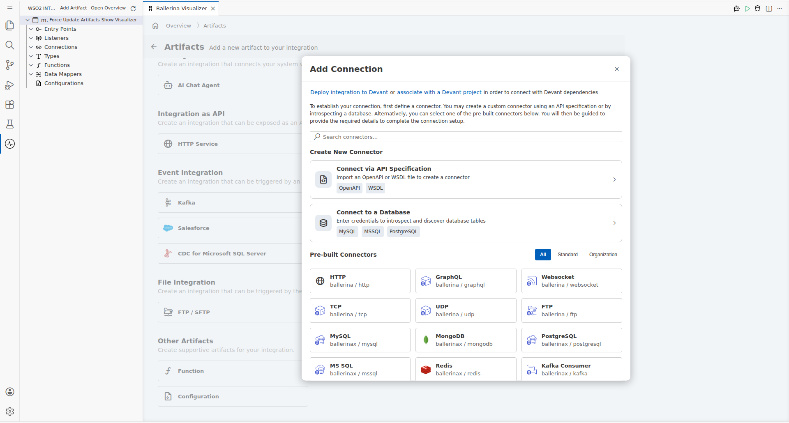
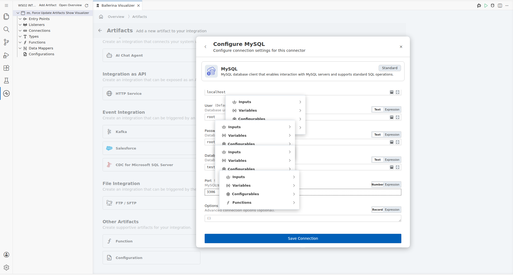
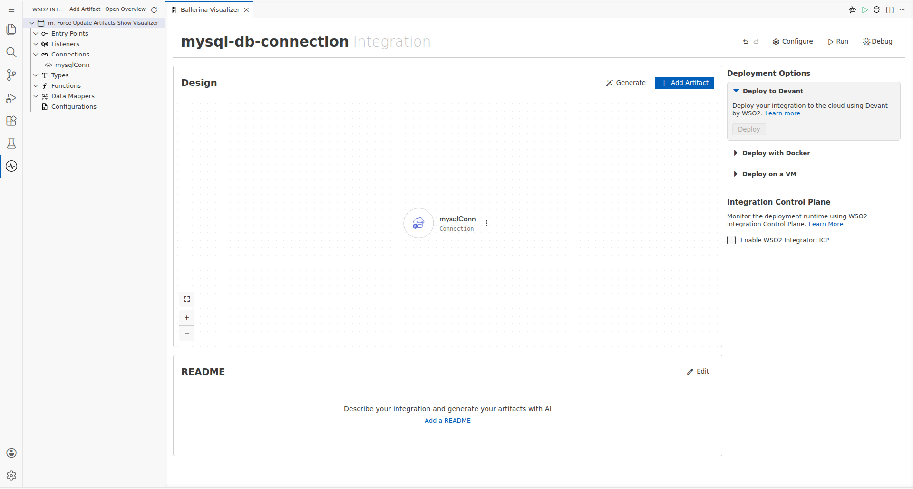
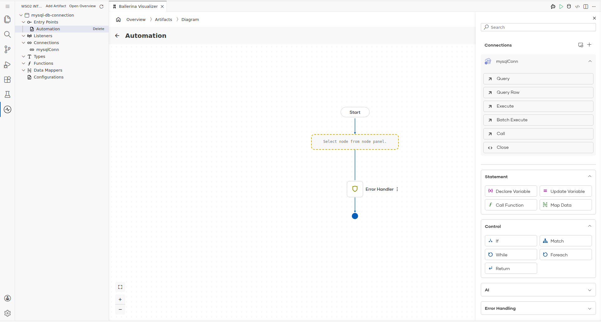
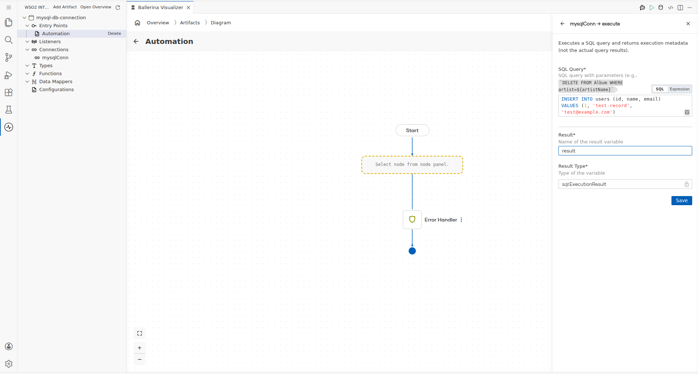
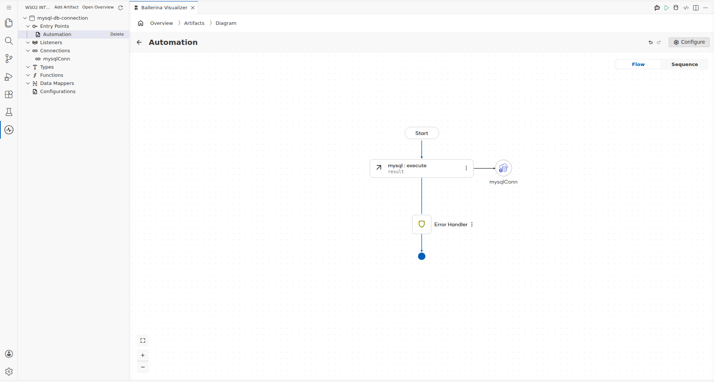

# MySQL Connector Example

## What You'll Build

This guide walks through setting up a MySQL database connector in WSO2 Integrator to insert a new record into a `users` table in a MySQL database named `testdb`. The integration uses an Automation entry point to schedule a periodic database write, calling the MySQL connector's Execute operation with a parameterized INSERT SQL query. The completed canvas flow connects an Automation trigger node to a MySQL Execute remote function node, ending with the standard End node.

**Operations used:**
- **Execute** — Executes a parameterized SQL INSERT statement against the specified MySQL database table, returning execution metadata (affected row count and generated keys).

## Prerequisites

- A running MySQL server accessible on your network.
- A MySQL user account (e.g., `root`) with INSERT privileges on the target database.
- A database named `testdb` with a `users` table containing columns: `id` (INT), `name` (VARCHAR), `email` (VARCHAR).

## Setting Up the MySQL Integration

> **New to WSO2 Integrator?** Follow the [Create a New Integration Project](../getting-started/create-integration.md) guide to set up your project first, then return here to add the connector.

## Adding the MySQL Connector

### Step 1: Open the Add Connection Palette

On the low-code canvas, click **"Add Artifact"** then select **"Connection"** from the Other Artifacts section (or click the **"+"** icon next to "Connections" in the sidebar) to open the connector search palette. The palette displays a search field, a "Create New Connector" section, and a grid of pre-built connector cards.

### Step 2: Search for and Select the MySQL Connector

Type `MySQL` in the connector search box to filter the results. Locate the **MySQL** connector card (labelled `ballerinax / mysql`) in the filtered list and click it to open its connection configuration form inline.

## Configuring the MySQL Connection

### Step 3: Enter MySQL Connection Parameters

Fill in all required connection fields in the MySQL configuration form. Expand the **Advanced Configurations** section to reveal the host, user, password, database, and port fields. Fill in the values shown below, then click **Save Connection** to persist the connection.

- **host**: `mysqlserver` — The hostname or IP address of the MySQL server.
- **port**: `3306` — The TCP port MySQL listens on (standard default).
- **user**: `root` — The MySQL account username used to authenticate.
- **password**: `root` — The MySQL account password used to authenticate.
- **database**: `testdb` — The name of the target MySQL database to connect to.
- **Connection Name**: `mysqlConn` — The variable name used to reference this connection throughout the integration.

### Step 4: Confirm the MySQL Connection Is Saved

After clicking **Save Connection**, the MySQL connector entry (`mysqlConn`) appears in the Connections section of the left sidebar and as a node on the low-code canvas, confirming the connection has been persisted successfully.

## Configuring the MySQL Execute Operation

### Step 5: Add an Automation Entry Point

On the low-code canvas, click **"Add Artifact"** and select **"Automation"** from the artifact list to add a scheduled trigger block to the flow. Click **"Create"** to create the Automation entry point. The Automation block appears on the canvas as the flow's entry point with a **Start** node.

### Step 6: Open the Step Addition Panel and Expand MySQL Operations

Inside the Automation flow canvas, click the **"+"** (Add Step) placeholder node to open the step-selection panel on the right. Locate the **mysqlConn** connection node under the **Connections** section of the panel and click it to expand and reveal all available database operations.

### Step 7: Select Execute Operation and Configure the SQL Query

Click the **Execute** operation from the expanded MySQL operations list to open its configuration panel. Fill in all required fields as listed below, then click **Save** to add the Execute step to the Automation flow.

- **SQL Query**: `INSERT INTO users (id, name, email) VALUES (1, 'test-record', 'test@example.com')` — The parameterized SQL INSERT statement targeting the `users` table.
- **id**: `1` — The integer primary key value for the new record row.
- **name**: `'test-record'` — The string value for the name column of the new record.
- **email**: `'test@example.com'` — The string value for the email column of the new record.
- **Variable Name** (output binding): `result` — The local variable that receives the execution result metadata returned by the Execute operation.

