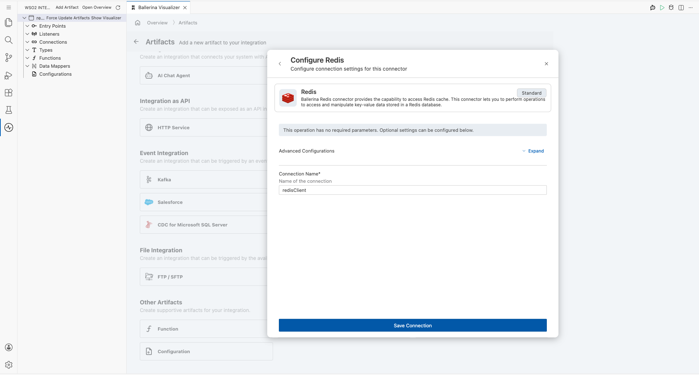
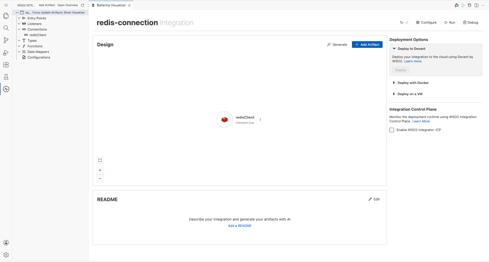
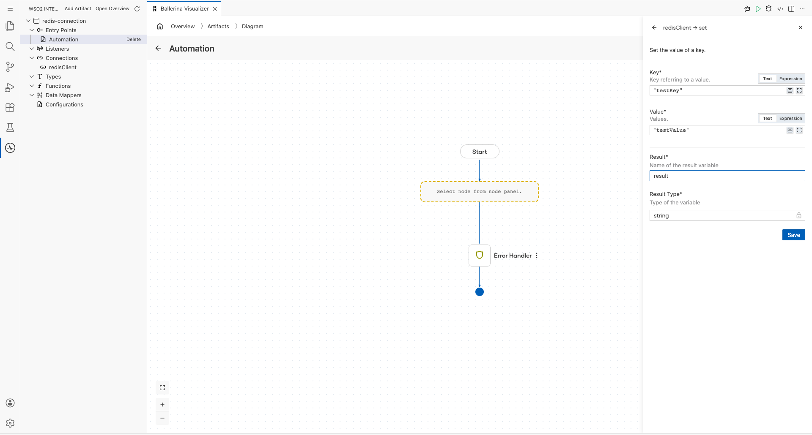
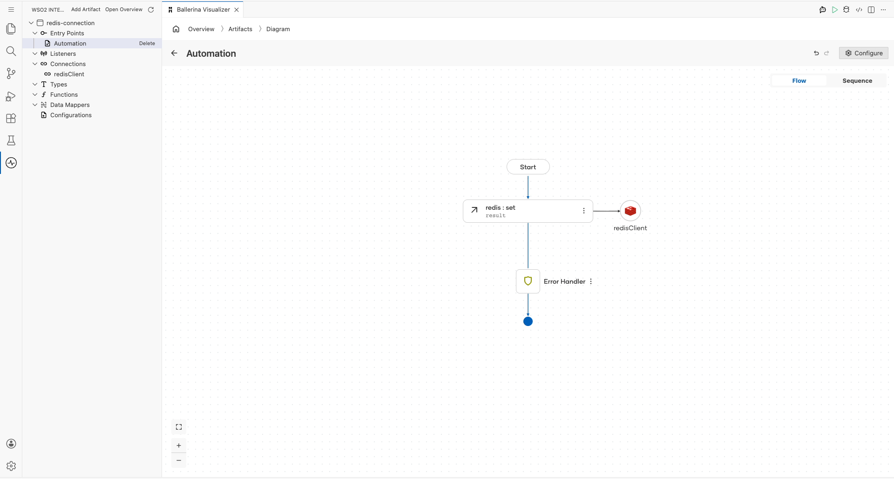

# Redis Connector Example

## What You'll Build

This integration demonstrates how to connect to a Redis in-memory data store using the WSO2 Integrator low-code designer and perform a key-value write operation using the `set` command. The flow uses an Automation entry point that triggers on a schedule, calls the Redis `set` remote function to store a value at a specified key, and completes the flow. By the end, you will have a fully configured Automation → Redis `set` → End canvas flow.

**Operations used:**
- **set** — Stores a string value at the specified key in the Redis data store, optionally with an expiry time.

## Prerequisites

- A running Redis server accessible at a reachable host address (default port, no authentication required for local development).

## Setting Up the Redis Integration

> **New to WSO2 Integrator?** Follow the [Create a New Integration Project](../getting-started/create-integration.md) guide to set up your project first, then return here to add the connector.

## Adding the Redis Connector

### Step 1: Open the Connector Search Panel
Click the **"Add Artifact"** button on the low-code canvas overview page, then select **"Connection"** from the **"Other Artifacts"** section to open the connector search panel.

### Step 2: Search for and Select the Redis Connector
In the connector list, locate the **Redis** connector card (labelled `ballerinax / redis`) from the pre-built connectors. Click on the Redis card to proceed to the connection configuration form.

## Configuring the Redis Connection

### Step 3: Enter Redis Connection Parameters and Save
Expand the **"Advanced Configurations"** section and fill in the Redis connection configuration form with the following values, then click **"Save Connection"** to create the connection.
- **Connection Name**: `redisClient` — A unique identifier for this Redis connection instance used throughout the integration.
- **Connection Type (URI)**: `"redis://[host]:[port]"` — The connection URI specifying the hostname and port of the Redis server.
- **Connection Pooling Enabled**: *(No Selection / default false)* — Leave as default; connection pooling is disabled for local development.
- **Cluster Mode Enabled**: *(No Selection / default false)* — Leave as default; cluster mode is not required for a single-node Redis instance.
- **Secure Socket Configurations**: `{}` — Leave empty; SSL/TLS is not required for a local Redis instance with no authentication.

### Step 4: Confirm the Connection is Saved
After clicking **"Save Connection"**, verify that the `redisClient` connection appears in the **Connections** section of the WSO2 Integrator sidebar tree on the left panel, and as a connection card on the canvas, confirming the connection was created successfully.

## Configuring the Redis set Operation

### Step 5: Add an Automation Entry Point and Configure the Redis `set` Operation
Click **"Add Artifact"** on the canvas, select **"Automation"** from the artifact list, then click **"Create"** to add a scheduled trigger entry point. In the Automation flow diagram, click the **"+"** node to open the node selection panel. Under **"Connections"**, expand **`redisClient`** and select the **`set`** operation. Fill in the operation parameters as follows and click **"Save"**.
- **Key**: `"testKey"` — The Redis key under which the value will be stored.
- **Value**: `"testValue"` — The string value to store at the specified key.
- **Result**: `result` — The variable that captures the return value of the `set` call.
- **Result Type**: `string` — The type of the result variable (automatically inferred).

### Step 6: Verify the Complete Canvas Flow
Confirm that the canvas displays a fully connected flow: **Automation (Start) → Redis `set` Remote Function → Error Handler → End**, with the `redisClient` connection icon attached to the `redis : set` node and no red error indicators visible on the flow nodes.
