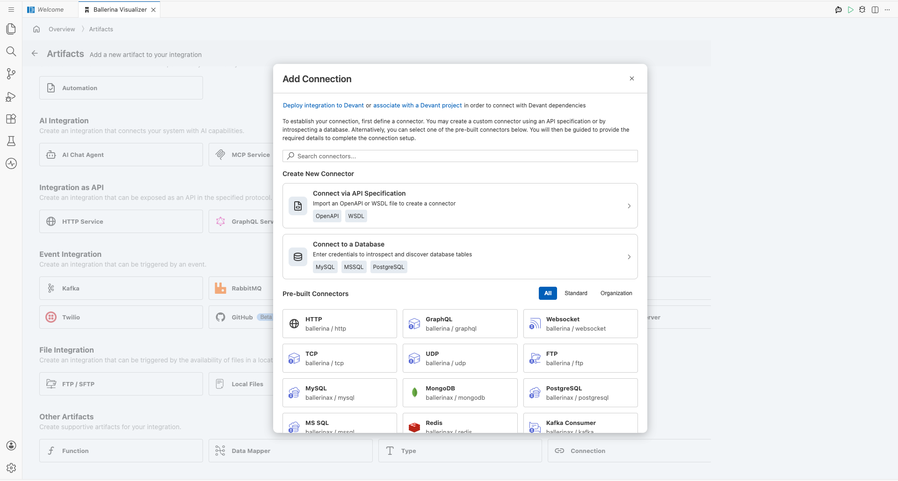
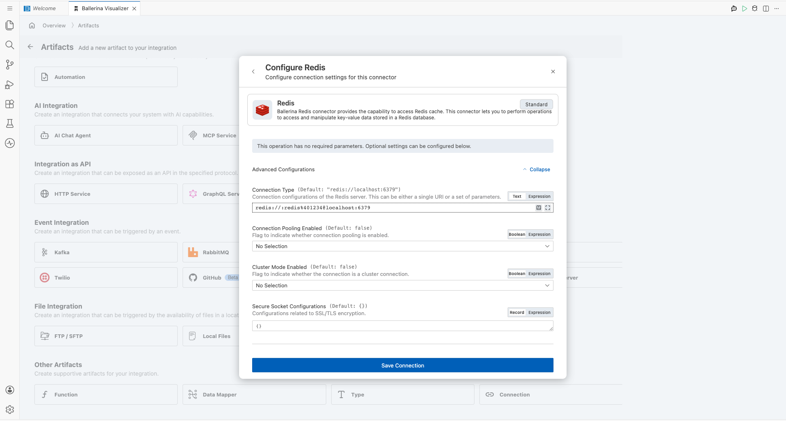
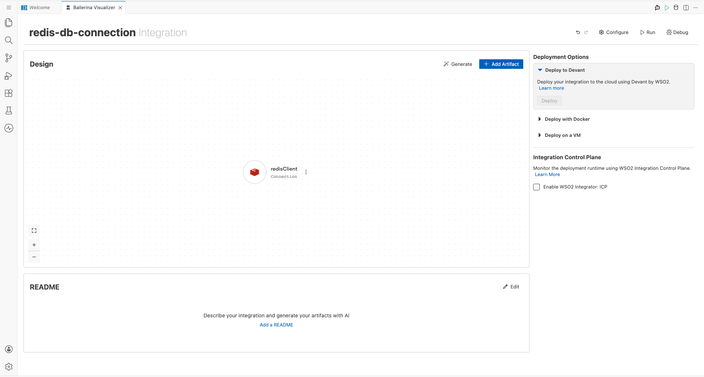
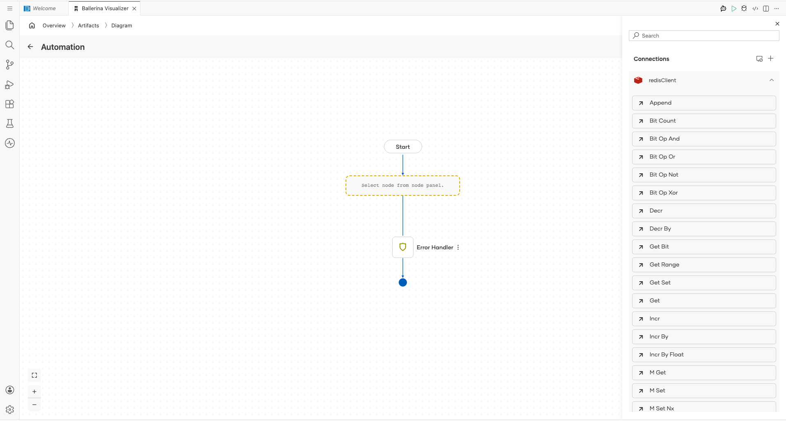
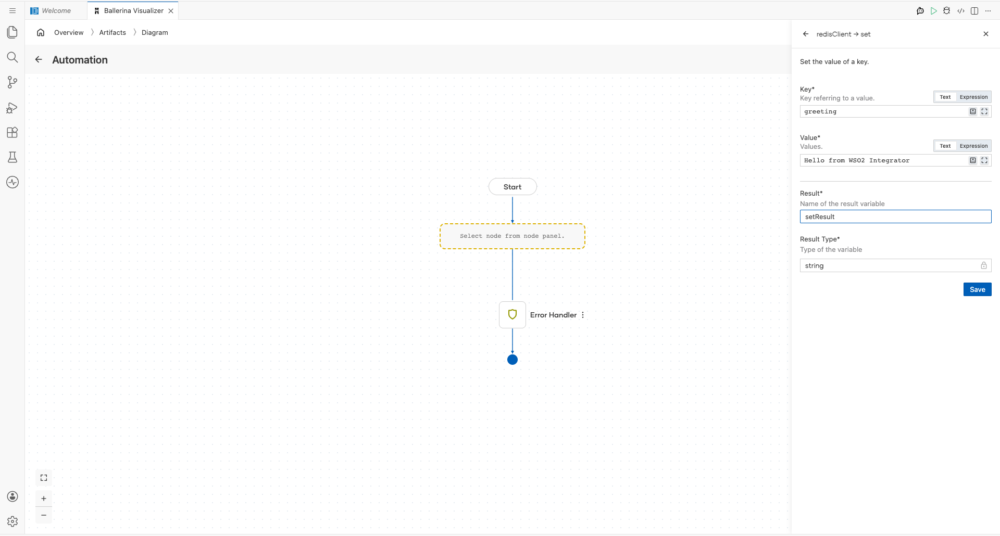
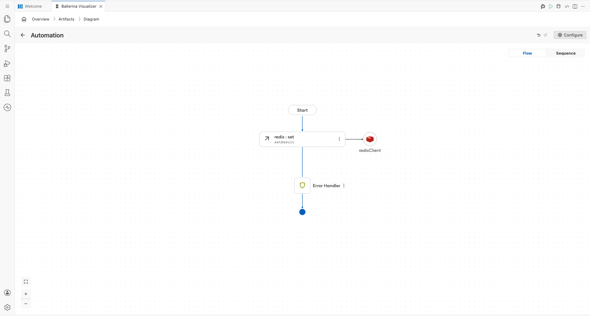

# Redis Connector Example

## What You'll Build

This guide demonstrates how to integrate a Redis in-memory data store into a WSO2 Integrator low-code project. You will configure a Redis connection, add an Automation entry point to drive the flow on a schedule, and wire a `set` remote function call that stores a key-value pair in Redis. The completed canvas shows an end-to-end Automation → Redis `set` → End flow ready for deployment.

**Operations used:**
- **set** — Stores a string value at a specified key in the Redis data store, with an optional TTL (time-to-live) for automatic expiry.

## Prerequisites

- A running Redis server accessible at your configured host and port.
- If Redis authentication is enabled, ensure the password is set on the server.

## Setting Up the Redis Integration

> **New to WSO2 Integrator?** Follow the [Create a New Integration Project](../getting-started/create-integration.md) guide to set up your project first, then return here to add the connector.

## Adding the Redis Connector

### Step 1: Open the Add Connection Palette
On the low-code canvas, click **"+ Add Artifact"** and then select **"Connection"** under the **Other Artifacts** section to open the **Add Connection** palette. The palette displays a search field and a grid of available pre-built connectors — including HTTP, GraphQL, MySQL, MongoDB, PostgreSQL, Redis, and many more.

### Step 2: Search for and Select the Redis Connector
Type **`Redis`** in the search box to filter the connector list, then click the **Redis** connector card (labelled `ballerinax / redis`) that appears in the results. The Redis connection configuration form opens, ready for parameter input.

## Configuring the Redis Connection

### Step 3: Enter Redis Connection Parameters
Fill in all required fields in the Redis connection configuration form with the values below. Expand the **Advanced Configurations** section to reveal the connection URI and additional options.
- **Connection Name**: `redisClient` — a descriptive identifier for this Redis connection instance used throughout the integration project
- **Connection Type (URI)**: the full Redis connection URI encoding the host, port, and password
- **Connection Pooling Enabled**: `false` (default) — set to `true` only when connection pooling is needed for high-throughput scenarios
- **Cluster Mode Enabled**: `false` (default) — set to `true` only when connecting to a Redis Cluster; leave false for a single-node setup
- **Secure Socket Configurations**: `{}` (default) — leave empty unless SSL/TLS encryption is required for the Redis connection

### Step 4: Save the Redis Connection
Click **Save Connection** to persist the Redis connection. The connector entry labelled `redisClient` appears as a **Connection** node on the low-code canvas, confirming the connection has been successfully registered.

## Configuring the Redis Set Operation

### Step 5: Add an Automation Entry Point
On the low-code canvas, click **"+ Add Artifact"** and select **"Automation"** from the Artifacts panel (under the **Automation** section). In the **Create New Automation** dialog that appears, click **Create** to accept the defaults. The Automation block is added as the entry point of the integration flow, visible in the canvas diagram as a **Start** node.

### Step 6: Expand the Redis Connection Node to View Available Operations
Inside the Automation flow diagram, click the **"+"** placeholder node to open the right-side step-addition panel. In the **Connections** section of the panel, click the **`redisClient`** connection node to expand it and reveal all available Redis operations — including string operations (Append, Get, Set, Incr, Decr), list operations (L Push, L Pop, R Push), set operations (S Add, S Members), sorted-set operations (Z Add, Z Range), hash operations (H Get, H Set), and key operations (Del, Exists, Expire, Ttl).

### Step 7: Select the `set` Operation and Configure Its Input Fields
Click the **`Set`** operation from the expanded list to open its configuration panel on the right side, then populate all input fields as shown below. Click **Save** to add the operation to the Automation flow.
- **key**: `greeting` — the Redis key under which the value will be stored; use a meaningful string that identifies the data
- **value**: `Hello from WSO2 Integrator` — the string value to store at the specified key in the Redis data store
- **Result**: `setResult` — the local variable that captures the return value of the `set` operation for downstream use
- **Result Type**: `string` — the type of the result variable, automatically inferred from the `set` operation return type

## More Examples

For additional usage patterns and real-world scenarios, browse the [Redis connector examples](https://central.ballerina.io/ballerinax/redis/latest#examples) on Ballerina Central.
