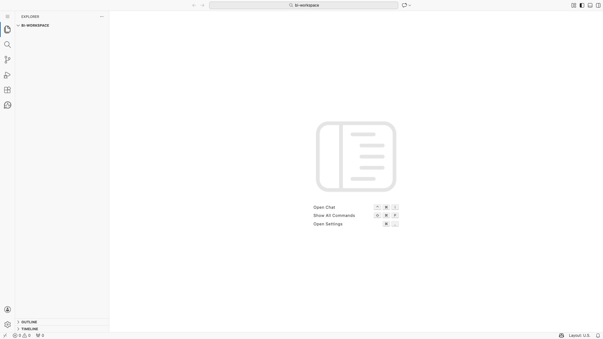
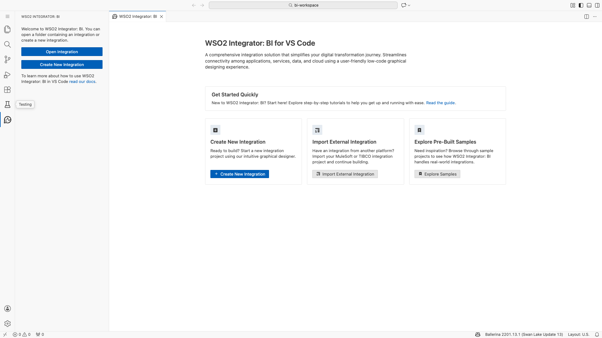
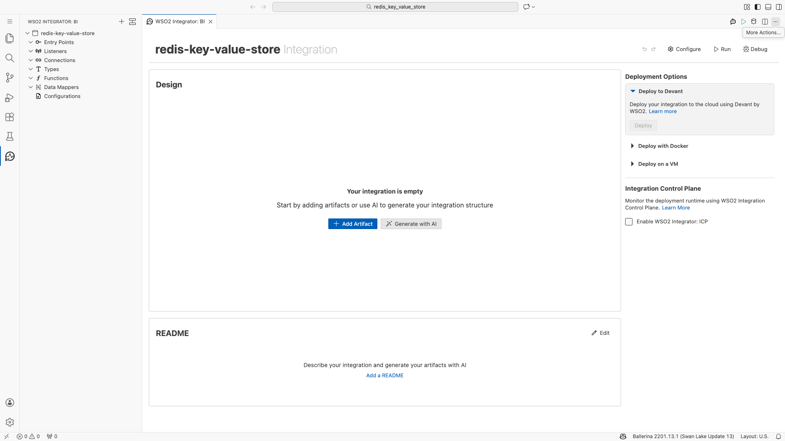
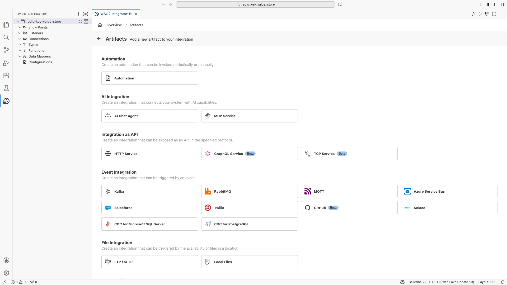
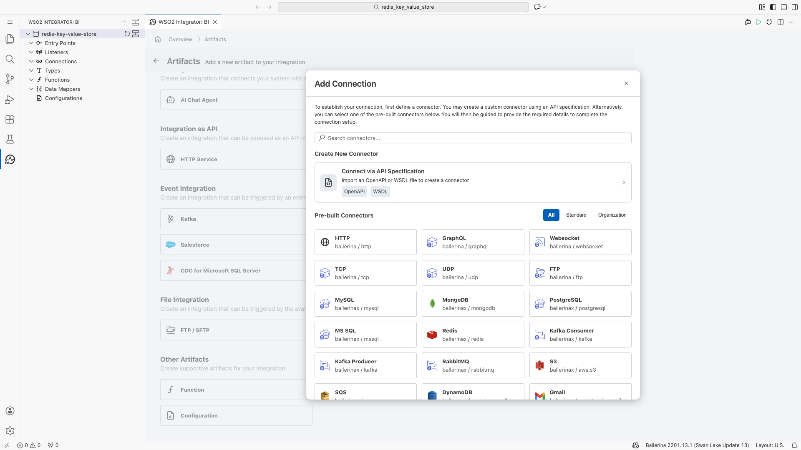
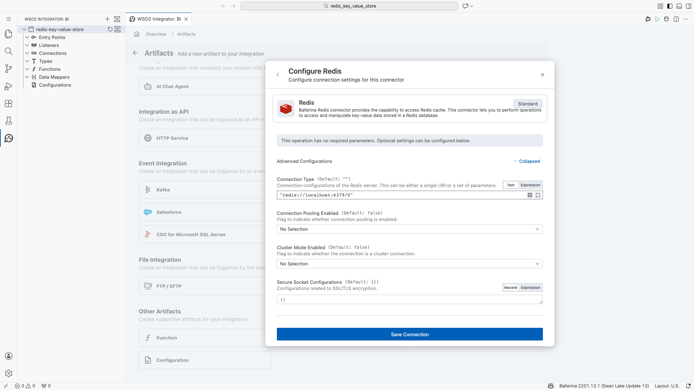
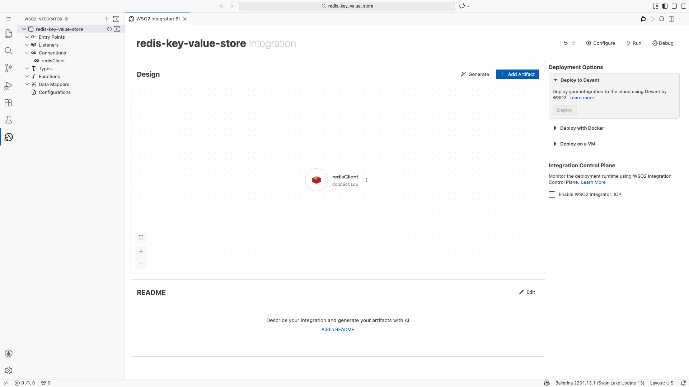
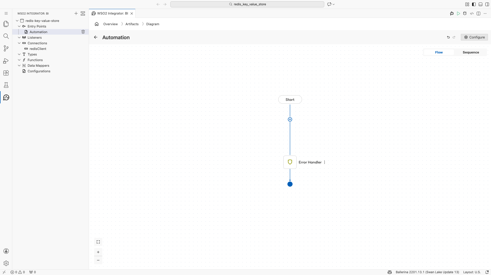
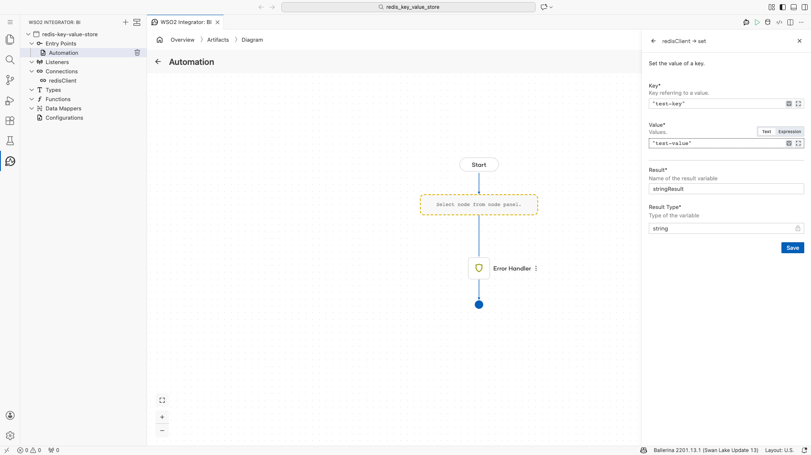
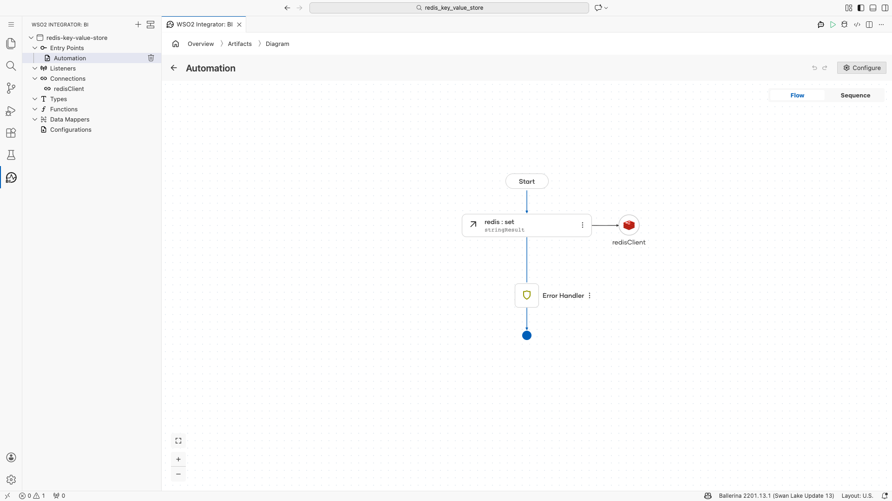

# Redis Connection & SET Operation Guide
## Using WSO2 Integrator: BI (Low-Code)

**Date:** 2026-03-03
**Integration Name:** `redis-key-value-store`
**Connector:** `ballerinax/redis:3.1.0`
**Workspace:** `~/bi-workspace/redis_key_value_store`

---

## Overview

This guide documents the complete workflow for creating a Redis connection and configuring a SET key-value operation using the **WSO2 Integrator: BI** low-code interface inside VS Code (code-server). All steps were performed exclusively through the low-code canvas — no `.bal` files were edited manually.

---


## Stage-by-Stage Walkthrough

### Stage 1 — Navigate to Code-Server & Create Workspace

Opened code-server at `http://localhost:8080`, created the `~/bi-workspace` folder, and opened it as a clean VS Code workspace.



---

### Stage 2 — Open WSO2 Integrator: BI

Activated the WSO2 Integrator: BI extension panel from the Activity Bar to access the integration designer.



---

### Stage 3 — Create New Integration

Clicked **"Create New Integration"**, entered the name `redis-key-value-store`, and confirmed creation. VS Code navigated to the new project folder at `~/bi-workspace/redis_key_value_store`.



---

### Stage 4 — Explore Low-Code UI Components

Clicked **"Add Artifact"** to explore available artifact types including Automation, HTTP Service, Event Integration, and Connection options.



---

### Stage 5 — Locate Redis Connector

Navigated to **Other Artifacts → Connection**, searched for Redis and found `ballerinax/redis` in the pre-built connectors list. Clicking it triggered an automatic pull of the module from Ballerina Central.

> **Module pulled:** `ballerinax/redis:3.1.0` ✅



---

### Stage 6 — Configure Redis Connection Parameters

After the module download, the **"Configure Redis"** form appeared. Expanded the **Advanced Configurations** section and entered the connection URI.

| Parameter | Value |
|-----------|-------|
| Connection Type (URI) | `"redis://localhost:6379/0"` |
| Connection Pooling | Default (false) |
| Cluster Mode | Default (false) |
| Connection Name | `redisClient` |



---

### Stage 7 — Connection Saved

Clicked **"Save Connection"**. The `redisClient` connection appeared immediately in:
- The sidebar tree under **Connections → redisClient**
- The integration canvas as a Connection artifact card



---

### Stage 8 — Create Automation Entry Point

Clicked **"Add Artifact"** on the canvas, selected **Automation**, and clicked **"Create"** to generate a new automation entry point (`main` function).



---

### Stage 9 — Configure Redis SET Operation

In the Automation flow diagram, clicked the **"+"** node to open the node selection panel. Selected **redisClient → Set** to add the Redis SET remote function call.

Configured the SET operation with:

| Parameter | Value |
|-----------|-------|
| Key | `"test-key"` |
| Value | `"test-value"` |
| Result Variable | `stringResult` |
| Result Type | `string` |



---

### Stage 10 — Flow with SET Node

After saving, the Automation flow diagram updated to show the `redis:set` node connected to the `redisClient` connection.


---

### Stage 11 — Complete Flow Verified ✅

The complete flow was verified with **0 compilation errors** and 1 minor warning (unused result variable — expected for fire-and-forget SET operations).

**Flow:** `Start → redis:set (stringResult) → Error Handler → End`



---

## Generated Source Code

The WSO2 BI low-code canvas generated the following Ballerina source in `automation.bal`:

```ballerina
import ballerina/log;

public function main() returns error? {
    do {
        string stringResult = check redisClient->set("test-key", "test-value");
    } on fail error e {
        log:printError("Error occurred", 'error = e);
        return e;
    }
}
```

And in `connections.bal` (auto-generated):

```ballerina
import ballerinax/redis;

final redis:Client redisClient = check new ({
    connection: "redis://localhost:6379/0"
});
```

---

## Configuration Summary

| Setting | Value |
|---------|-------|
| **Connector** | `ballerinax/redis:3.1.0` |
| **Connection Name** | `redisClient` |
| **Redis Host** | `localhost` |
| **Redis Port** | `6379` |
| **Database Index** | `0` (embedded in URI) |
| **Connection URI** | `redis://localhost:6379/0` |
| **Operation** | `SET` |
| **Key** | `test-key` |
| **Value** | `test-value` |
| **Entry Point** | Automation (`main()`) |
| **Result Variable** | `stringResult` (type: `string`) |

---

## Run Statistics

| Metric | Value |
|--------|-------|
| **Total Stages** | 11 |
| **Screenshots Captured** | 11 |
| **Errors at Completion** | 0 |
| **Warnings at Completion** | 1 (unused variable — expected) |
| **Module Pull** | `ballerinax/redis:3.1.0` from Ballerina Central |
| **Files Generated** | `automation.bal`, `connections.bal`, `Ballerina.toml`, `main.bal`, `config.bal`, `types.bal`, `functions.bal`, `data_mappings.bal` |
| **Low-Code Only** | ✅ No `.bal` files manually edited |

---

## Key Observations

1. **URI-based connection**: The `ballerinax/redis` connector supports a `ConnectionUri` type allowing a single Redis URI string (`redis://host:port/db`) instead of separate host/port/database fields.

2. **Automatic error handling**: The WSO2 BI Automation template auto-generates an `on fail` error handler with `log:printError`, providing built-in resilience without manual coding.

3. **Module auto-pull**: Selecting the Redis connector in the UI automatically downloads `ballerinax/redis:3.1.0` from Ballerina Central — no manual `bal pull` command needed.

4. **Quick-fix support**: The IDE's quick-fix feature (via the Problems panel) can fix compilation issues like unused imports without manually editing source files.

5. **Connection reuse**: The `redisClient` connection defined once in the Connection artifact is automatically available to all Automation, HTTP Service, and other entry points in the integration.

---

*Generated by WSO2 Integrator: BI automation workflow — 2026-03-03*
