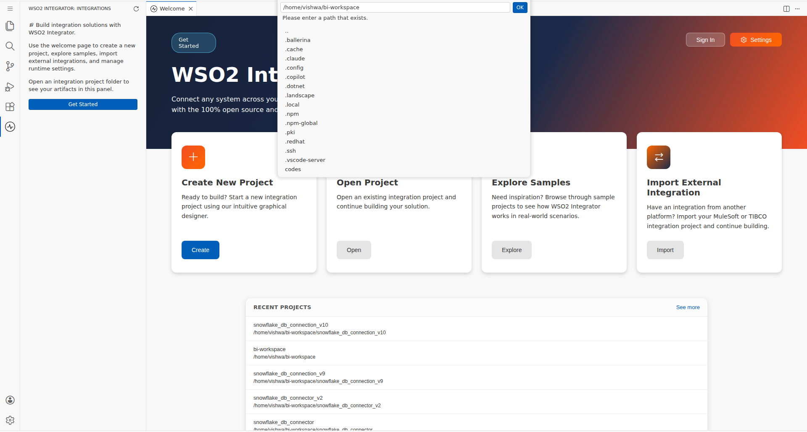
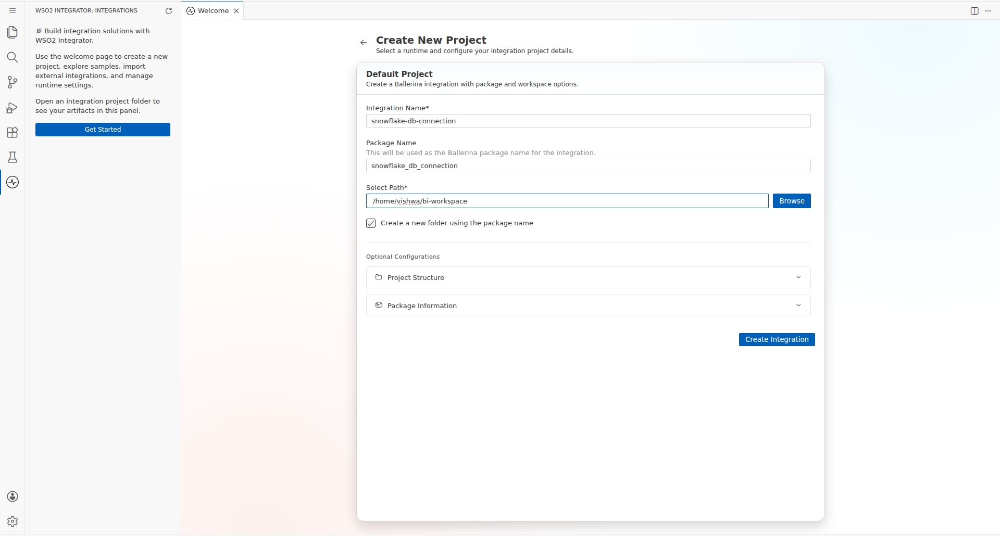
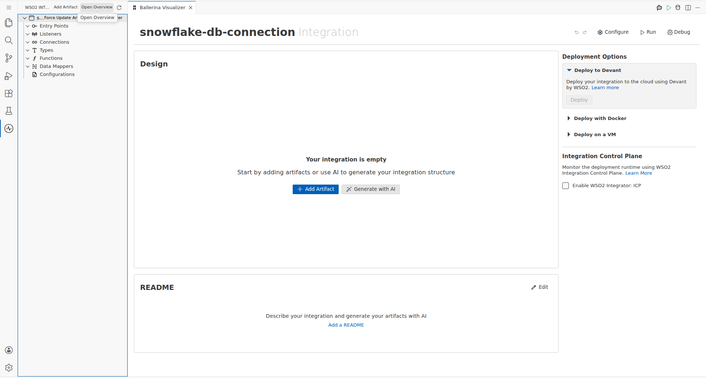
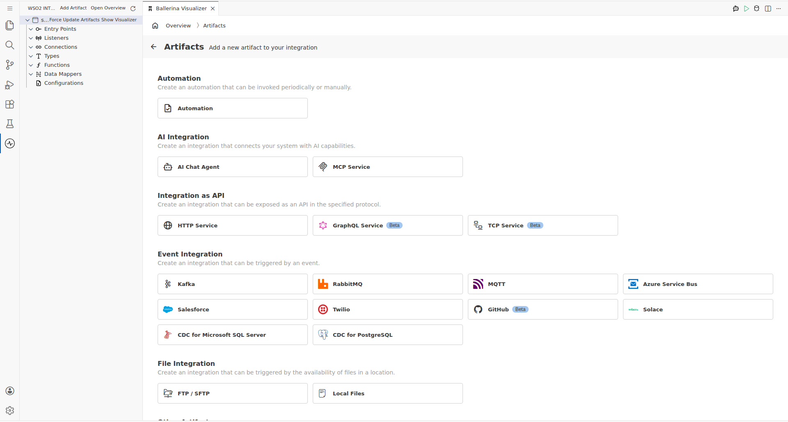
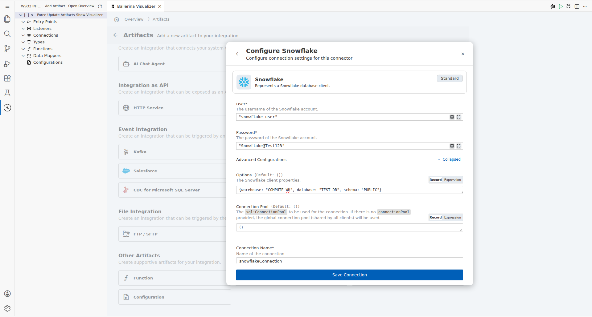
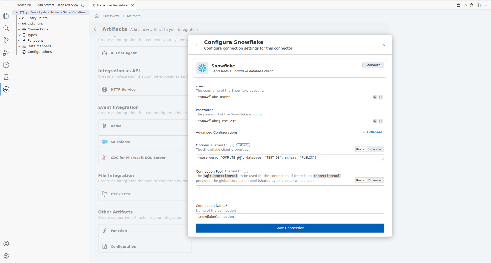
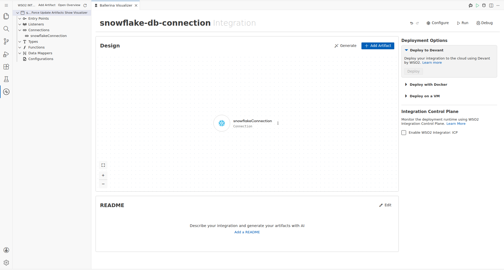
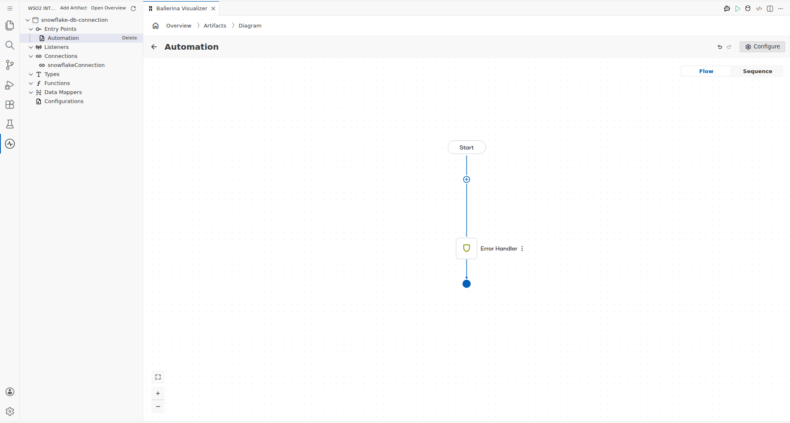
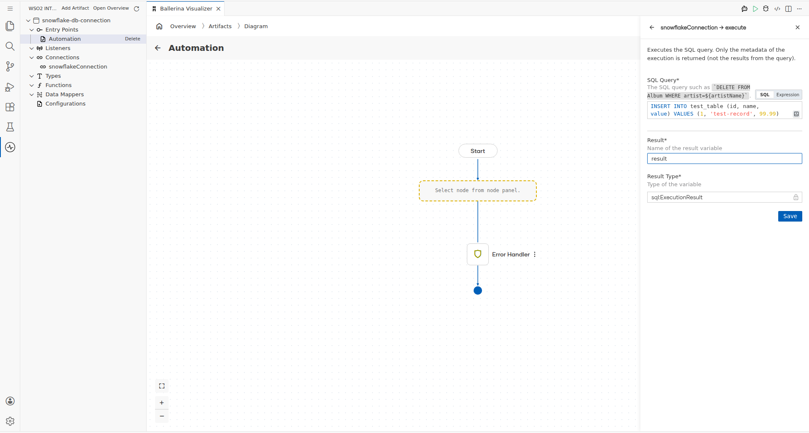
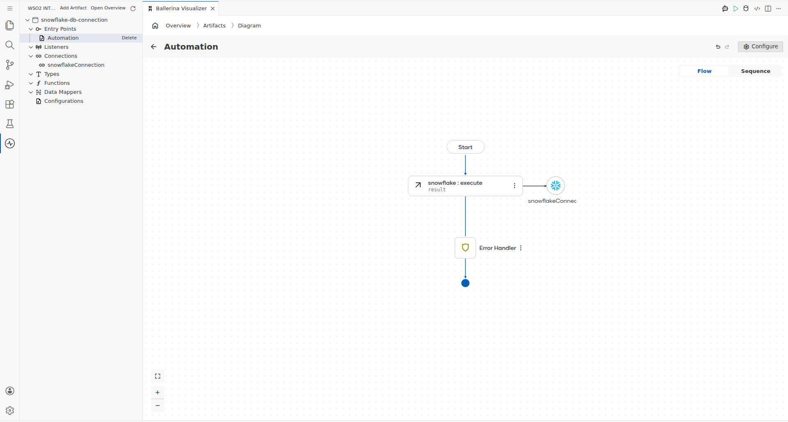

# Snowflake Connector Example

## What You'll Build

This integration demonstrates how to connect to a Snowflake data warehouse using the WSO2 Integrator low-code extension and execute SQL statements via an Automation entry point. The workflow configures a Snowflake connection and runs an INSERT operation against a target table.

**Operations used:**
- **execute** — Executes an INSERT/UPDATE/DELETE SQL statement and returns execution metadata such as affected row count

## Prerequisites

- A Snowflake account with a valid account identifier, username, and password
- A Snowflake virtual warehouse, database, and schema available for use (e.g., `COMPUTE_WH`, `TEST_DB`, `PUBLIC`)

## Setting Up the Snowflake Integration

### Step 1: Open the WSO2 Integrator Extension
Click the **WSO2 Integrator** icon in the VS Code Activity Bar to open the WSO2 Integrator panel in the sidebar.

### Step 2: Create a New Integration Project
In the WSO2 Integrator sidebar, click **"Create New Integration"** and fill in the project details:
- **Integration Name**: `snowflake-db-connection`

Click **Create** to scaffold the project. The WSO2 Integrator Visualizer tab opens automatically, showing an empty canvas.

### Step 3: View the New Integration Canvas
Confirm the empty WSO2 Integrator Visualizer canvas is displayed after project creation.

### Step 4: Navigate to the Artifacts Palette
In the Visualizer, click **Artifacts** in the breadcrumb navigation. The Artifacts palette opens, showing sections for Entry Points, Connections, Types, Functions, Data Mappers, and Configurations.

## Adding the Snowflake Connector

### Step 5: Search for and Select the Snowflake Connector
Under **Connections** in the Artifacts palette, click the **"+"** button. In the connector search modal, type `snowflake` and select the **`ballerinax/snowflake`** connector card (Standard variant). The **"Configure Snowflake"** form panel opens on the right side of the canvas.

## Configuring the Snowflake Connection

### Step 6: Fill In the Connection Form and Save
Enter the following values in the connection configuration form:
- **Account Identifier**: `"myorg-myaccount"` — Your Snowflake account identifier
- **User**: `"snowflake_user"` — Snowflake username for authentication
- **Password**: `"Snowflake@Test123"` — Snowflake user password
- **Options**: `{warehouse: "COMPUTE_WH", database: "TEST_DB", schema: "PUBLIC"}` — Virtual warehouse, database, and schema context (enter in Expression mode)
- **Connection Name**: `snowflakeConnection` — Name used to reference this connection in the flow

Click **Save** to persist the connection.

### Step 7: Confirm the Connection Is Saved
Verify that `snowflakeConnection` appears in the sidebar tree under **Connections** and as a connection node on the Artifacts canvas.

## Configuring the Snowflake Execute Operation

### Step 8: Add an Automation Entry Point
From the Artifacts palette, click **"+"** next to **Entry Points** and select **Automation**. The Automation flow is created and the Diagram view activates, showing a Start node, a placeholder node, an Error Handler node, and an End node.

### Step 9: Select and Configure the Execute Operation
On the Automation flow canvas, click the **"+"** button on the placeholder node between Start and Error Handler. Select **Connections** → **snowflakeConnection** → **execute**. In the configuration panel that opens, fill in the operation parameters:
- **SQL Query**: `` `INSERT INTO test_table (id, name, value) VALUES (1, 'test-record', 99.99)` `` — Parameterized INSERT statement using SQL template literal syntax
- **Result**: `result` — Variable name to store the execution result
- **Result Type**: `sql:ExecutionResult` — Auto-set; returns execution metadata such as affected row count

Click **Save** to add the execute step to the flow.

### Step 10: Confirm the Complete Flow
Verify the complete Automation flow displays correctly: Start → execute → Error Handler → End.
