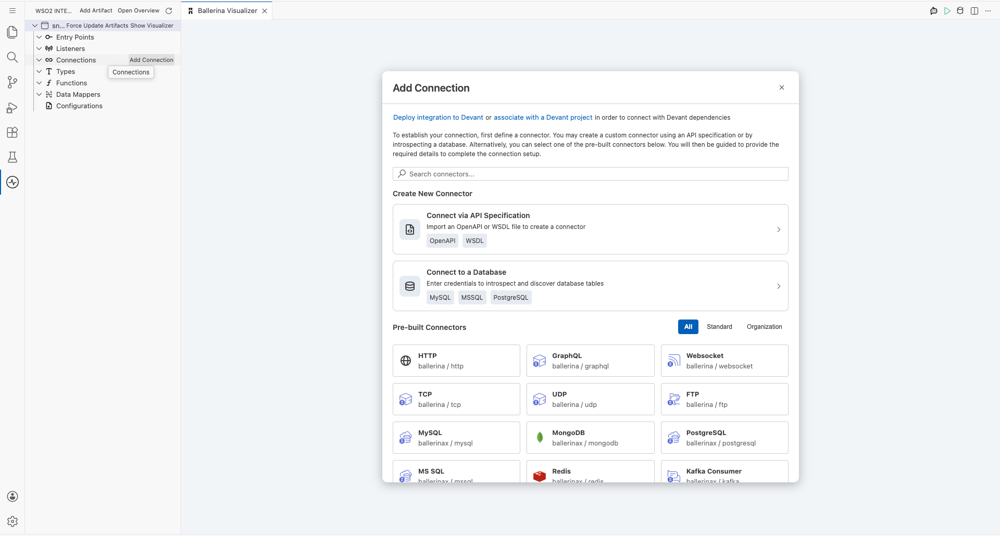
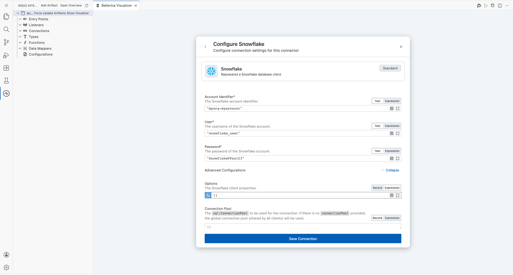
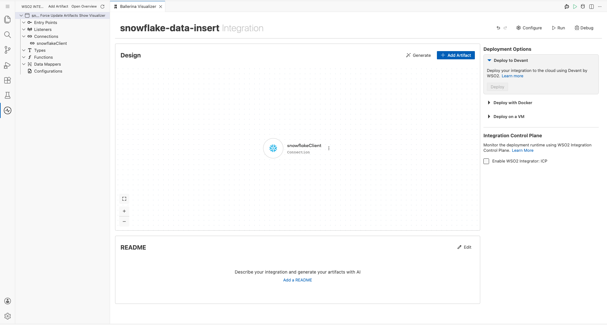
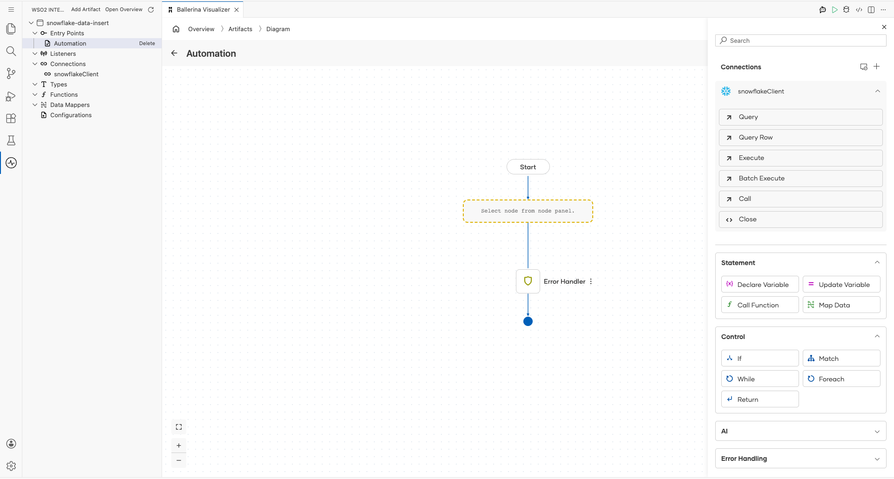
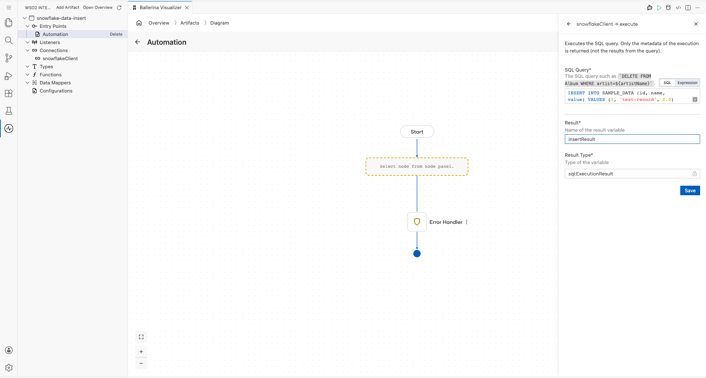
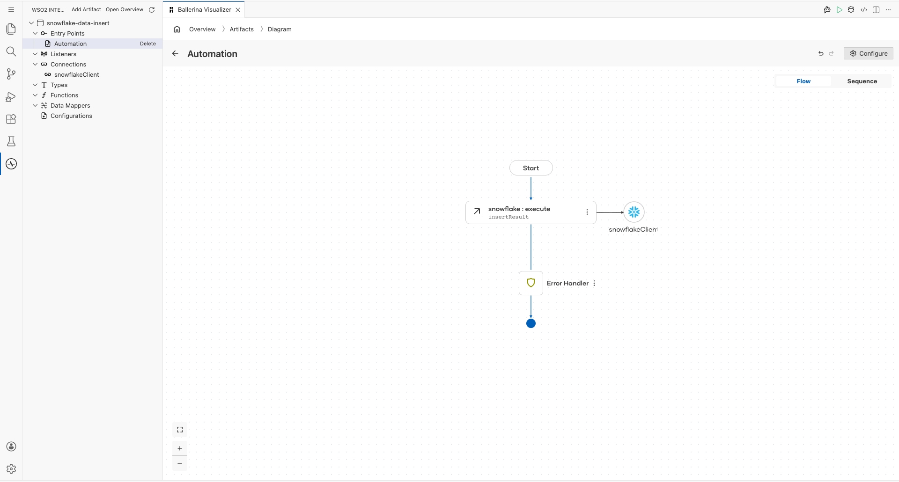

# Snowflake Connector Example

## What You'll Build

This integration demonstrates how to connect to a Snowflake cloud data warehouse using the WSO2 Integrator low-code canvas and insert example records into a Snowflake table. The workflow uses an Automation entry point (scheduled trigger) to call the Snowflake `execute` remote function, writing a typed SQL INSERT statement into the `SAMPLE_DATA` table in your configured Snowflake database. By the end of this guide, you will have a complete **Automation → Snowflake Execute (INSERT) → End** flow assembled on the low-code canvas.

**Operations used:**
- **Execute** — Executes a parameterized SQL statement (INSERT, UPDATE, or DELETE) against a Snowflake table using the configured connection. Returns execution metadata (`sql:ExecutionResult`) rather than row data.

## Prerequisites

- A Snowflake account with a valid Account Identifier (e.g., `myorg-myaccount` or `accountname.region`).
- A Snowflake user (`snowflake_user`) with INSERT privileges on the target database and schema.
- A target table (`SAMPLE_DATA`) with columns `id` (INTEGER), `name` (VARCHAR), and `value` (FLOAT) pre-created in your Snowflake database.

## Setting Up the Snowflake Integration

> **New to WSO2 Integrator?** Follow the [Create a New Integration Project](../getting-started/create-integration.md) guide to set up your project first, then return here to add the Snowflake connector.

## Adding the Snowflake Connector

### Step 1: Open the Connector Palette

In the low-code canvas, click **"Add Connection"** (or the "+" button that appears when hovering over the "Connections" section in the WSO2 Integrator sidebar) to open the connector search palette. The palette displays a search field and a list of all available pre-built connectors, including HTTP, MySQL, MongoDB, Redis, and many more.

### Step 2: Search for and Select the Snowflake Connector

Type `Snowflake` in the search box to filter the connector list. When the **Snowflake** connector card appears (labelled `ballerinax / snowflake`), click it to open the Snowflake connection configuration form.

## Configuring the Snowflake Connection

### Step 3: Enter Snowflake Connection Parameters

Fill in all required Snowflake connection parameters in the configuration form as shown below:

- **Account Identifier**: `"myorg-myaccount"` — The unique Snowflake account identifier in the format `orgname-accountname` (or `accountname.region` for legacy accounts), used to locate your Snowflake instance.
- **User**: `"snowflake_user"` — The Snowflake username used to authenticate the connection.
- **Password**: `"SnowflakeP@ss123"` — The password associated with the Snowflake username. Treat this as a secret and use a secure credential store or configurable variable in production.
- **Options** *(Advanced — optional)*: Leave as `()` (empty) to use the connector defaults, or supply a `snowflake:Options` record expression to configure advanced connection behaviour.
- **Connection Pool** *(Advanced — optional)*: Leave as `()` to use the global shared connection pool.

> **Connection Name** is auto-populated as `snowflakeClient` — this is the variable name used to reference this connection throughout your integration flow.

### Step 4: Save the Snowflake Connection

Click the **Save Connection** button to persist the Snowflake connection. The `snowflakeClient` connector entry now appears in the **Connections** section of the WSO2 Integrator sidebar and as a connection node on the low-code canvas, confirming the connection was saved successfully.

## Configuring the Snowflake Execute Operation

### Step 5: Add an Automation Entry Point

On the canvas, click **"Add Artifact"** to open the artifacts palette, then click **"Automation"** to add a scheduled trigger entry point to the integration. The Automation entry point (named `main`) appears in the **Entry Points** section of the sidebar and opens the flow diagram view showing a **Start** node and an **Error Handler** block.

### Step 6: Expand the Snowflake Connection Node to View Operations

Inside the Automation flow, click the **"+"** node to open the step-addition panel on the right side. In the **Connections** section of the panel, locate the `snowflakeClient` node and click it to expand and reveal all available Snowflake operations.

### Step 7: Select the Execute Operation and Configure the INSERT Statement

Click **"Execute"** from the expanded Snowflake operations list to open its configuration panel. Fill in all required fields with the example INSERT data:

- **SQL Query**: An INSERT statement that inserts one example row into the `SAMPLE_DATA` table with `id = 1`, `name = 'test-record'`, and `value = 0.0`.
- **Result**: `insertResult` — Local variable name to capture the `sql:ExecutionResult` returned by the Execute operation (contains affected row count and generated keys).
- **Result Type**: `sql:ExecutionResult` — Set automatically; read-only.

Click **Save** to confirm the Execute operation configuration.

### Step 8: Verify the Completed Flow on Canvas

After saving the Execute operation, the canvas displays the complete integration flow: **Start → snowflake : execute (`insertResult`) → snowflakeClient → Error Handler → End**. The `snowflakeClient` Snowflake connection node is connected to the execute step, confirming the operation is correctly wired to the configured connector.

Confirm that all nodes are connected and there are no unresolved error indicators on any node.

## More Examples

For additional usage patterns and real-world scenarios, browse the [Snowflake connector examples](https://central.ballerina.io/ballerinax/snowflake/latest#examples) on Ballerina Central.
