# Snowflake Connector Integration Guide

## WSO2 Integrator: BI — Low-Code Canvas Walkthrough

---

## 1. Overview

This guide documents the end-to-end process of creating a **Snowflake database connector integration** using the **WSO2 Integrator: BI** low-code canvas (VS Code / code-server). The integration demonstrates how to:

- Create a new Ballerina integration project (`snowflake-db-connection-v2`)
- Configure a `ballerinax/snowflake` connection with full credentials
- Add an **Automation** entry point
- Invoke the Snowflake `execute` remote function with a SQL `INSERT` statement
- Verify the complete flow on the low-code diagram canvas

**Integration Name:** `snowflake-db-connection-v2`
**Platform:** WSO2 Integrator: BI (Ballerina 2201.13.1 Swan Lake Update 13)
**Connector:** `ballerinax/snowflake` (`snowflake:Client`)
**Entry Point Type:** Automation (periodic/manual invocation)

---

## 2. Prerequisites

| Requirement | Details |
|---|---|
| **WSO2 Integrator: BI extension** | Installed in VS Code / code-server |
| **Ballerina** | 2201.13.1 (Swan Lake Update 13) or compatible |
| **Snowflake Account** | Active Snowflake account with credentials |
| **Workspace folder** | `/home/vishwa/bi-workspace/` (or any bi-workspace folder) |
| **Network access** | code-server accessible at `http://localhost:8080` |

**Snowflake Connection Parameters used in this guide:**

| Parameter | Value |
|---|---|
| Account Identifier | `myorg-myaccount` |
| Username | `snowflake_user` |
| Password | `P@ssw0rd123!` |
| Database | `TESTDB` |
| Schema | `PUBLIC` |
| Warehouse | `COMPUTE_WH` |

---

## 3. Step-by-Step Configuration

### Step 1 — Open the WSO2 Integrator: BI Panel

Launch code-server at `http://localhost:8080`. Open the bi-workspace folder via **Application Menu → File → Open Folder**, navigate to `/home/vishwa/bi-workspace/`, and click **Open**. Trust the workspace authors when prompted.

The WSO2 Integrator: BI sidebar panel will load, showing the project tree and overview.

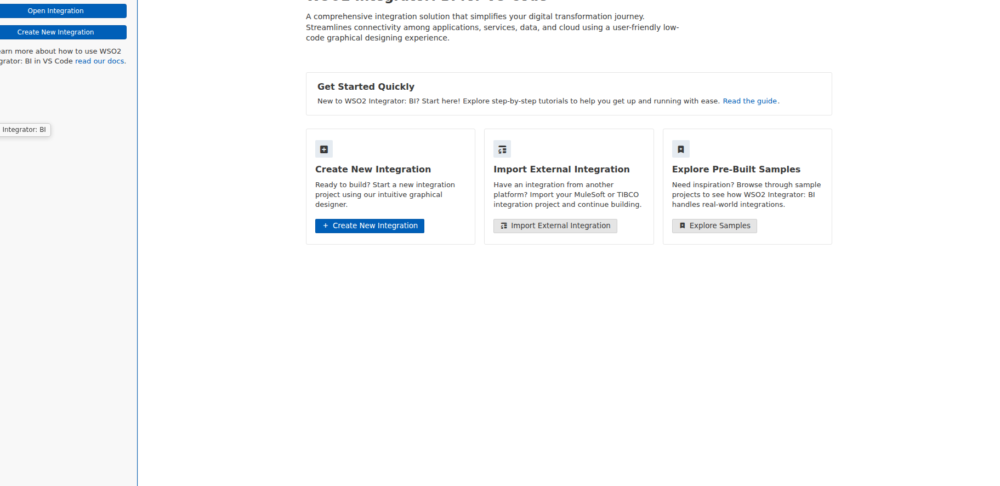

---

### Step 2 — Create a New Integration

From the WSO2 Integrator: BI panel, click the **+** (Add Project) button. Enter the integration name `snowflake-db-connection-v2` (the `-v2` suffix was required because `snowflake-db-connection` already existed in the workspace). Select the workspace directory and confirm.

The low-code canvas opens, showing an empty integration canvas for `snowflake-db-connection-v2`.

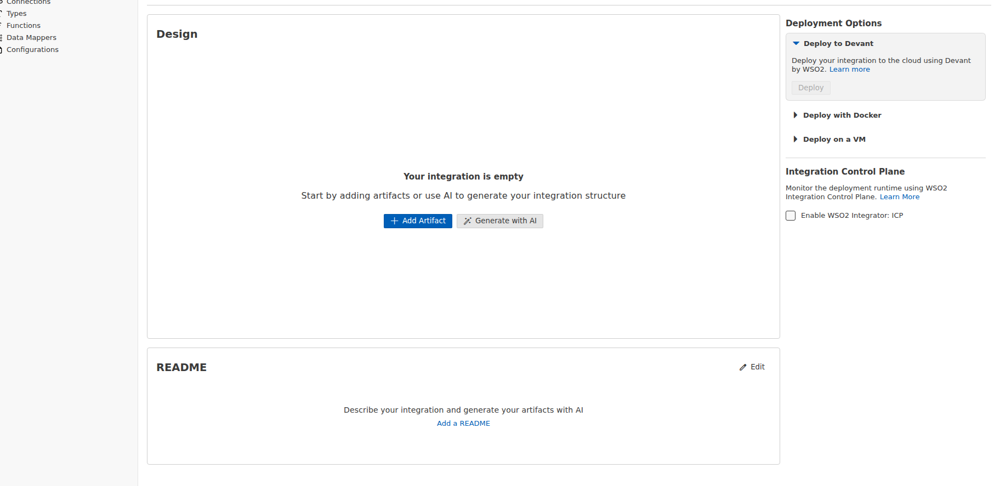

---

### Step 3 — Open the Artifacts Palette

Click **Add Artifact** on the canvas or use the Artifacts panel to open the component palette. The palette shows available artifact types: **Automation**, **Connection**, **HTTP Service**, **GraphQL API**, and more.

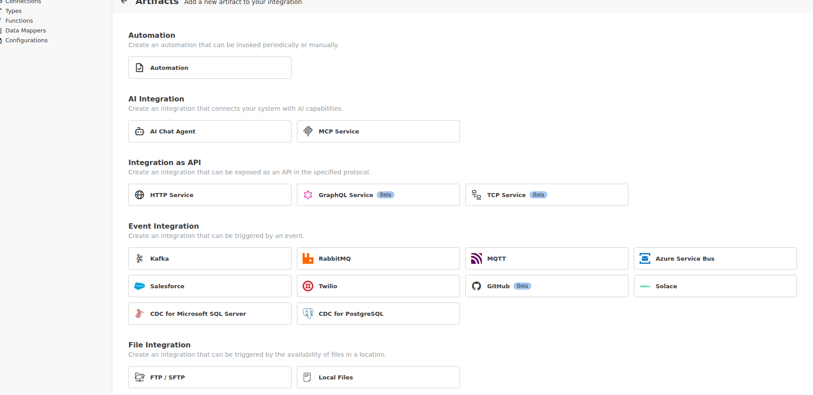

---

### Step 4 — Search for the Snowflake Connector

In the Artifacts palette, click **Connection** → search for `Snowflake`. Two results appear:
- **Snowflake** — standard connector (`ballerinax/snowflake`)
- **Snowflake Advanced** — advanced/extended connector

Select **Snowflake** (standard).

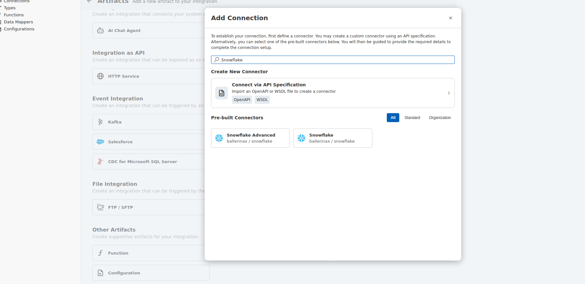

---

### Step 5 — Configure the Snowflake Connection

The **Configure Snowflake** panel opens. Fill in the connection fields:

| Field | Value |
|---|---|
| **Connection Name** | `snowflakeConnection` |
| **Account Identifier** | `myorg-myaccount` |
| **User** (Username) | `snowflake_user` |
| **Password** | `P@ssw0rd123!` |

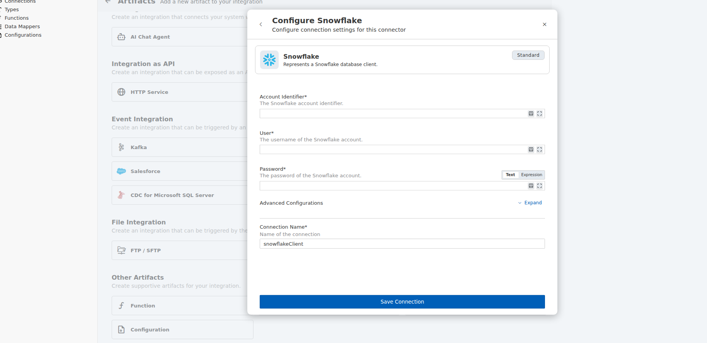

After filling the primary fields, the **Advanced Configurations** section contains the `Options` field for `snowflake:Options`. Since **Database**, **Schema**, and **Warehouse** are not top-level fields, switch the `Options` parameter to **Expression** mode and enter:

```ballerina
{database: "TESTDB", schema: "PUBLIC", warehouse: "COMPUTE_WH"}
```

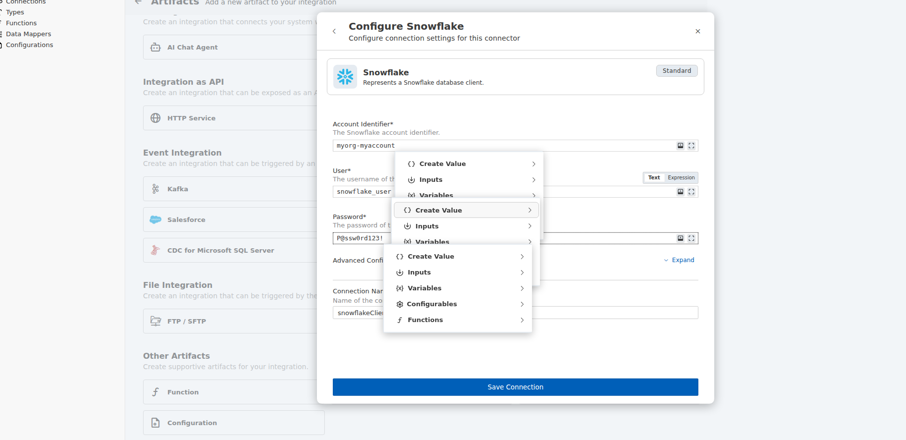

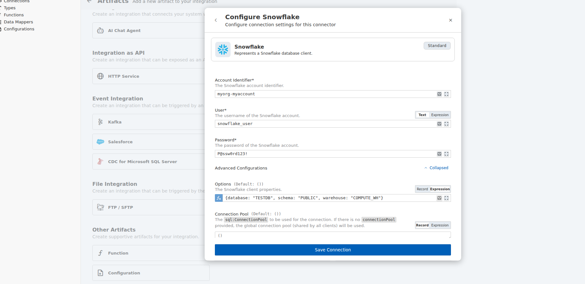

Click **Save**. The `snowflakeConnection` appears in the sidebar under **Connections** and as a Connection tile on the canvas.

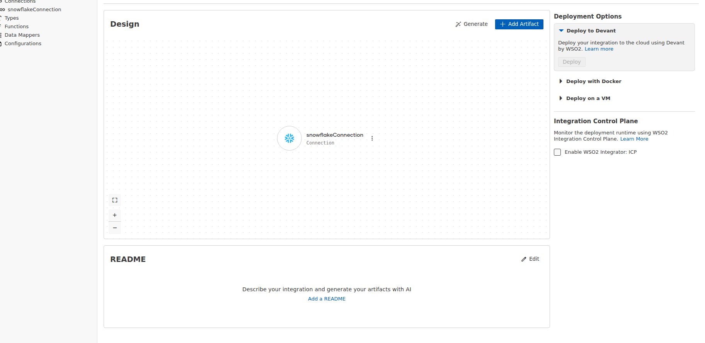

---

### Step 6 — Add an Automation Entry Point

From the Artifacts palette, click **Automation** → **Create New Automation**. The form shows:
- **Description:** "Periodic invocation should be scheduled in an external system such as cronjob, k8s, or Devant"
- No additional configuration required for a basic automation

Click **Create**. The Automation entry point (`main`) is created and the flow diagram canvas opens.

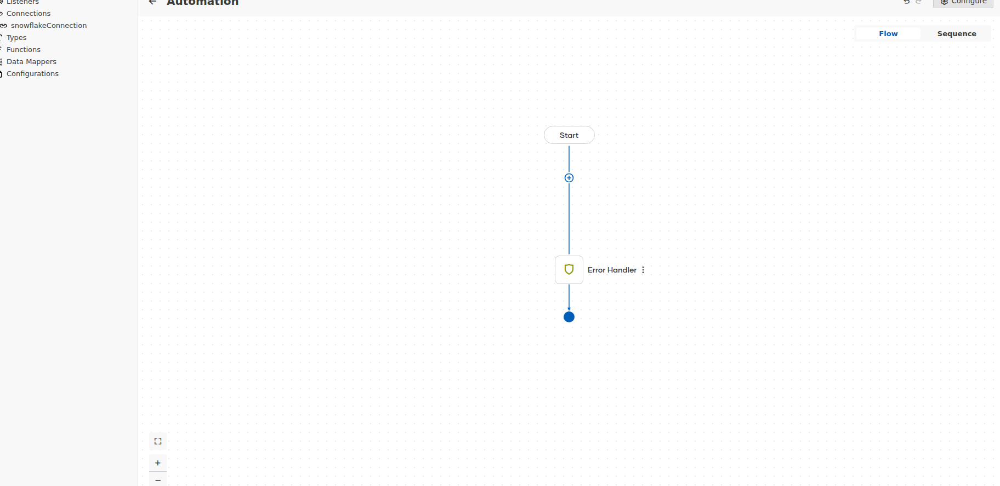

---

### Step 7 — Add the Snowflake Execute Operation

In the Automation flow canvas, click the **+** (add step) button between **Start** and **Error Handler**. The node panel opens, showing the **Connections** section with `snowflakeConnection` listed.

1. Click **snowflakeConnection** to expand its operations
2. Click **Execute** — "Executes the SQL query. Only the metadata of the execution is returned (not the results from the query)."

The `snowflakeConnection → execute` form opens. Fill in:

| Field | Value |
|---|---|
| **SQL Query** | `` `INSERT INTO test_table (id, name, value) VALUES (1, 'test-record', 0.0)` `` |
| **Result** (variable name) | `result` |
| **Result Type** | `sql:ExecutionResult` (auto-populated, read-only) |

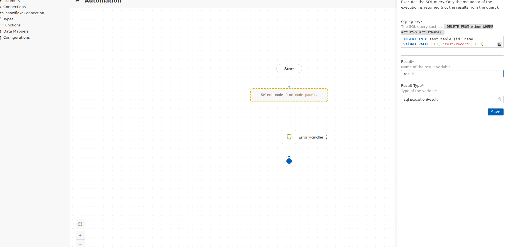

Click **Save**. The execute step is added to the flow diagram.


---

## 4. Flow Verification

### Complete Flow Diagram

After saving the Snowflake execute operation, the Automation flow diagram shows the complete pipeline:

```
Start
  │
  ▼
snowflake : execute ──────► snowflakeConnect (Snowflake icon)
  result (sql:ExecutionResult)
  │
  ▼
Error Handler
  │
  ▼
End (●)
```

The flow canvas confirms:
- **Start** node (entry trigger)
- **snowflake : execute** node — labeled with `result` variable, connected to `snowflakeConnect` connection icon
- **Error Handler** node — wraps the operation for fault tolerance
- **End** node (filled blue circle)

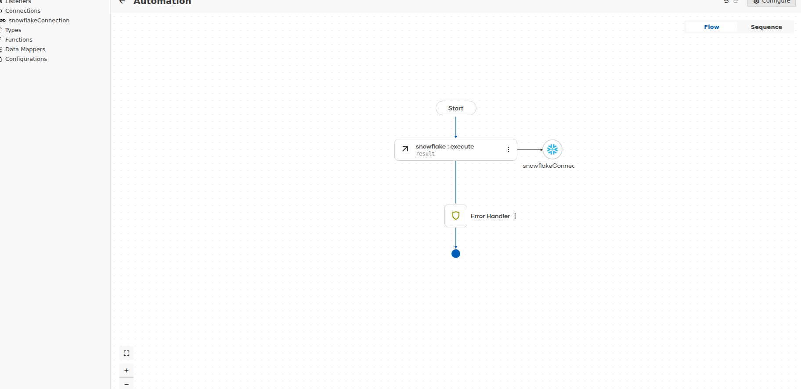

### Integration Overview

The project overview canvas shows the complete integration architecture with both artifacts:
- **Automation** tile (entry point) — connected via arrow to
- **snowflakeConnection** tile (Connection, Snowflake icon)

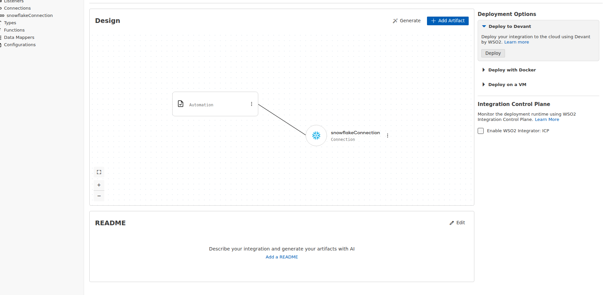

### Sidebar Tree Structure

The WSO2 Integrator: BI sidebar shows the full artifact tree:

```
snowflake-db-connection-v2
├── Entry Points
│   └── Automation (main)
├── Listeners
├── Connections
│   └── snowflakeConnection
├── Types
├── Functions
├── Data Mappers
└── Configurations
```

---

## 5. Troubleshooting / Notes

### Issue: Duplicate Integration Name
**Symptom:** "A directory with this name already exists at the selected location."
**Cause:** A previous integration `snowflake_db_connection` already existed in the workspace.
**Fix:** Use a version suffix in the integration name (e.g., `snowflake-db-connection-v2`).

### Issue: Database/Schema/Warehouse Not Visible as Top-Level Fields
**Symptom:** The Snowflake connection form does not show `Database`, `Schema`, or `Warehouse` as separate input fields.
**Cause:** These parameters are nested inside `snowflake:Options`, which is under **Advanced Configurations**.
**Fix:** Expand **Advanced Configurations** → switch the `Options` field to **Expression** mode → enter the record literal:
```ballerina
{database: "TESTDB", schema: "PUBLIC", warehouse: "COMPUTE_WH"}
```

### Issue: Context Dropdown After Password Fill
**Symptom:** After typing the Password value, a helper dropdown appears with "Create Value / Inputs / Variables / Configurables / Functions".
**Cause:** The expression editor detects input in the password field and offers completion options.
**Fix:** Press **Escape** to dismiss the dropdown before proceeding to the next field.

### Issue: Command Palette Mode Switching
**Symptom:** Using `Ctrl+Shift+P` and typing replaces the `>` prefix, switching the palette from "command mode" to "file search mode".
**Cause:** `browser_type`/`fill` replaces the entire textbox content including the `>` prefix.
**Fix:** Use **Application Menu → File → Open Folder** instead of the command palette for file system operations.

### SQL Query Syntax
The Snowflake `execute` operation uses Ballerina's **parameterized query** syntax. For plain SQL without parameters, wrap the query string in backtick template literals:
```ballerina
`INSERT INTO test_table (id, name, value) VALUES (1, 'test-record', 0.0)`
```
The backtick syntax (`` ` ``) denotes a `sql:ParameterizedQuery` — the standard type accepted by `sql:Client.execute()`.

### Connection Options Record
The `snowflake:Options` record supports additional tuning parameters beyond `database`, `schema`, and `warehouse`. Refer to the [ballerinax/snowflake connector documentation](https://central.ballerina.io/ballerinax/snowflake) for the full list of available options including connection pool settings via `sql:ConnectionPool`.

### Entry Point Scheduling
The **Automation** entry point in WSO2 Integrator: BI is designed for periodic or manual invocation. To schedule it:
- **Kubernetes:** Use a `CronJob` to invoke the integration executable
- **Devant (WSO2 Cloud):** Use the built-in scheduling feature from the Devant deployment panel
- **Docker:** Mount and invoke via an external cron daemon

---

*Documentation generated by the WSO2 Integrator: BI Playwright automation workflow.*
*Screenshots captured: 2026-03-13 | Ballerina 2201.13.1 (Swan Lake Update 13)*
