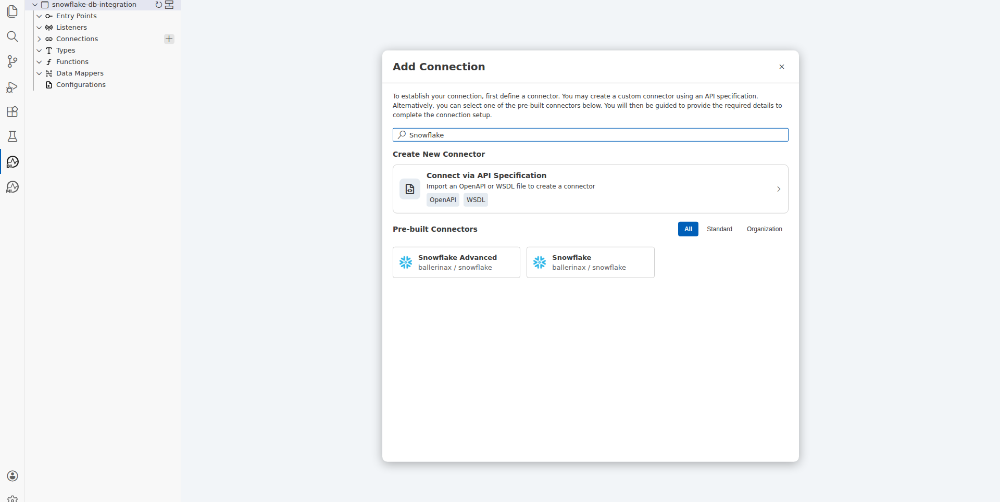
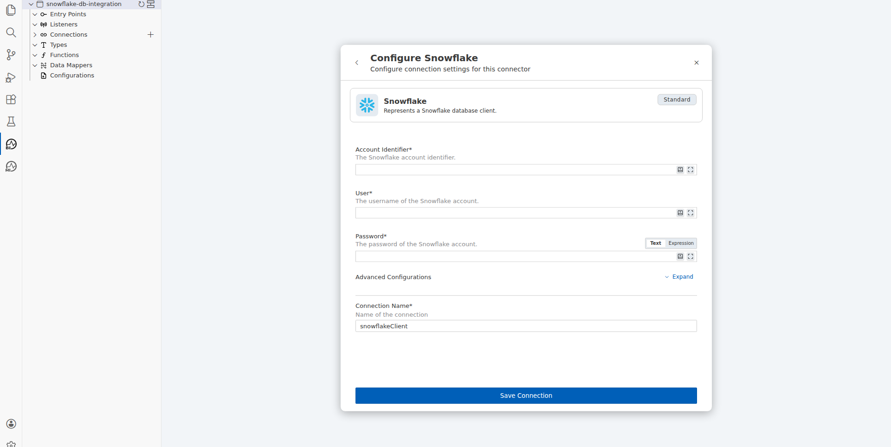
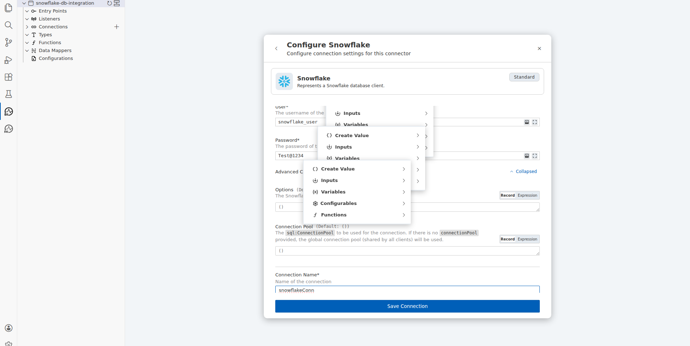
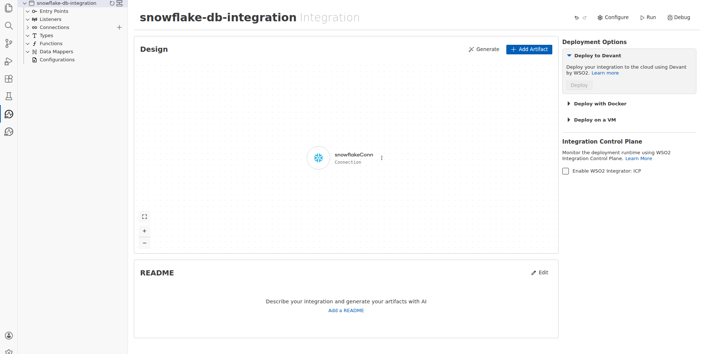
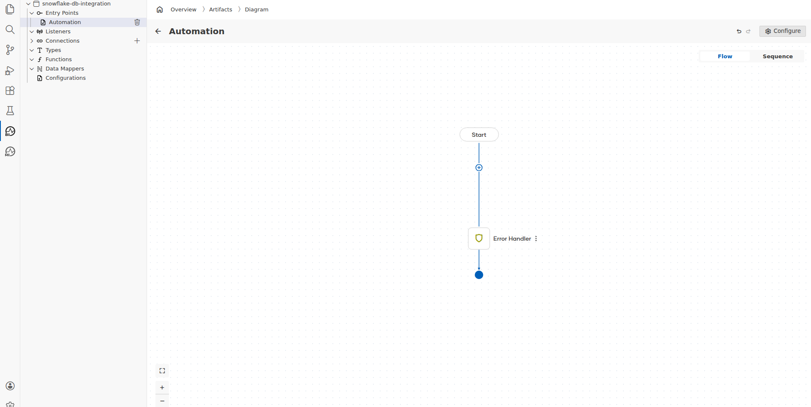
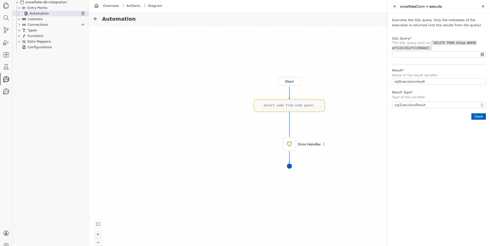
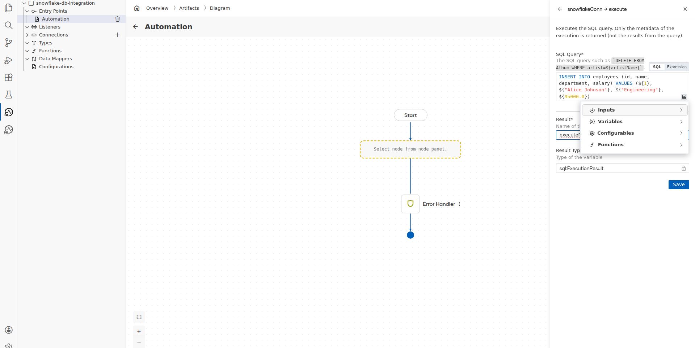
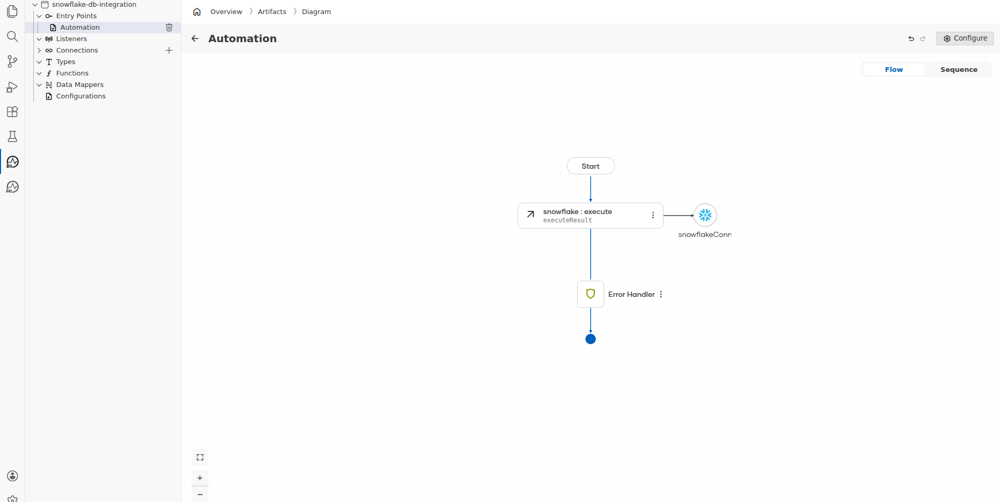

# Snowflake Connector Example

## What You'll Build

This guide walks you through creating an integration that connects to a Snowflake database and executes a SQL INSERT statement using the WSO2 Integrator: BI low-code designer. The integration uses an Automation entry point to run the database operation.

**Operations used:**
- `snowflakeConn->execute` — Executes a parameterized SQL query against a Snowflake database and returns execution metadata.

## Prerequisites

- WSO2 Integrator: BI extension installed in VS Code
- A Snowflake account with a valid account identifier, username, and password
- An existing Snowflake database and schema with an `employees` table

## Setting Up the Snowflake Integration

Open the WSO2 Integrator: BI panel from the left activity bar by clicking the WSO2 Integrator: BI icon. The panel displays options to open an existing integration or create a new one.

**Step 1:** Click **Create New Integration** in the panel or on the welcome canvas.

A form appears prompting you to name the integration and select a workspace path.

**Step 2:** Fill in the integration details:
- **[Integration Name]**: snowflake-db-integration — The display name for the integration project.
- **[Package Name]**: snowflake_db_integration — Auto-populated from the integration name; used as the project package identifier.
- **[Path]**: /home/vishwa/bi-workspace — The workspace folder where the project files are created.

Click **Create Integration**. The project reloads into the new integration workspace and the design canvas opens.

## Adding the Snowflake Connector

The design canvas shows the integration structure. To add a database connection, locate the **Connections** section in the left sidebar and click the **+** (Add Connection) button next to it.

The **Add Connection** dialog opens with a search field and a list of pre-built connectors.

**Step 3:** Type `Snowflake` in the search field. Two Snowflake connectors appear in the results.

**Step 4:** Click the **Snowflake** connector tile (ballerinax / snowflake — Standard). The connector configuration form opens.

## Configuring the Snowflake Connection

The **Configure Snowflake** panel shows the required connection fields.

**Step 5:** Fill in the connection parameters:
- **[Account Identifier]**: xy12345.us-east-1 — The unique identifier for your Snowflake account, including region suffix.
- **[User]**: snowflake_user — The Snowflake username used for authentication.
- **[Password]**: Test@1234 — The password for the Snowflake account.
- **[Connection Name]**: snowflakeConn — The identifier used to reference this connection within the integration flow.

**Step 6:** Click **Save Connection**. The `snowflakeConn` connection node appears on the design canvas confirming the connection was saved.

## Configuring the Snowflake Execute Operation

With the connection in place, add an Automation entry point and configure the execute operation.

**Step 7:** Click **Add Artifact** on the canvas, then select **Automation** from the artifact list. Click **Create** to add the automation. The flow diagram opens showing a **Start** node and an **Error Handler** node.

**Step 8:** Click the **+** button between the Start node and the Error Handler to add a new step. In the node selection panel that appears, expand **snowflakeConn** under the Connections section to reveal its operations, then click **Execute**.

The **snowflakeConn → execute** configuration panel opens on the right side of the canvas.

**Step 9:** Fill in the execute operation parameters:
- **[SQL Query]**: `` `INSERT INTO employees (id, name, department, salary) VALUES (${1}, ${"Alice Johnson"}, ${"Engineering"}, ${95000.0})` `` — The parameterized SQL INSERT statement using Ballerina template literal syntax.
- **[Result]**: executeResult — The variable name that stores the `sql:ExecutionResult` returned by the operation.

**Step 10:** Click **Save**. The execute node is added to the flow diagram, connected to the `snowflakeConn` connection and labeled with the result variable name.

## Verifying the Snowflake Integration

The complete flow diagram shows the full integration sequence.

**Step 11:** Confirm the following elements are present on the canvas:
- **Start** node at the top of the flow.
- **snowflake : execute** node labeled `executeResult`, connected to the `snowflakeConn` Snowflake connection node.
- **Error Handler** node below the execute step.
- **End** node (filled circle) at the bottom.

The flow confirms the integration is correctly configured: the Automation triggers, executes the SQL INSERT against the Snowflake database using `snowflakeConn`, stores the result in `executeResult`, and terminates.

