# Snowflake Connector Example

## What You'll Build

In this guide, you will build a Ballerina integration using the WSO2 Integrator: BI low-code canvas that connects to a Snowflake data warehouse and executes an SQL INSERT statement. The integration uses the **Automation** entry point pattern, which runs as a standalone program without requiring an HTTP listener.

- **Connector:** `ballerinax/snowflake:2.2.0`
- **Integration pattern:** Automation (scheduled/manual trigger)
- **Operations used:**
  - `snowflake:Client->execute` — Executes a parameterized SQL statement against a Snowflake database and returns an `sql:ExecutionResult`

---

## Prerequisites

- WSO2 Integrator: BI extension installed in VS Code (code-server at `http://localhost:8080`)
- Ballerina Swan Lake Update 13 (version 2201.13.1) installed
- A Snowflake account with the following details available:
  - Account Identifier (e.g., `myorg-myaccount`)
  - Username and Password with sufficient privileges
  - An existing Warehouse, Database, Schema, and Role
- The `~/bi-workspace` folder available as the workspace root

---

## Setting Up the Snowflake Integration

### Step 1 — Open the workspace in VS Code

Launch code-server and open the `~/bi-workspace` folder. The WSO2 Integrator: BI panel appears in the Primary Side Bar once the extension activates.

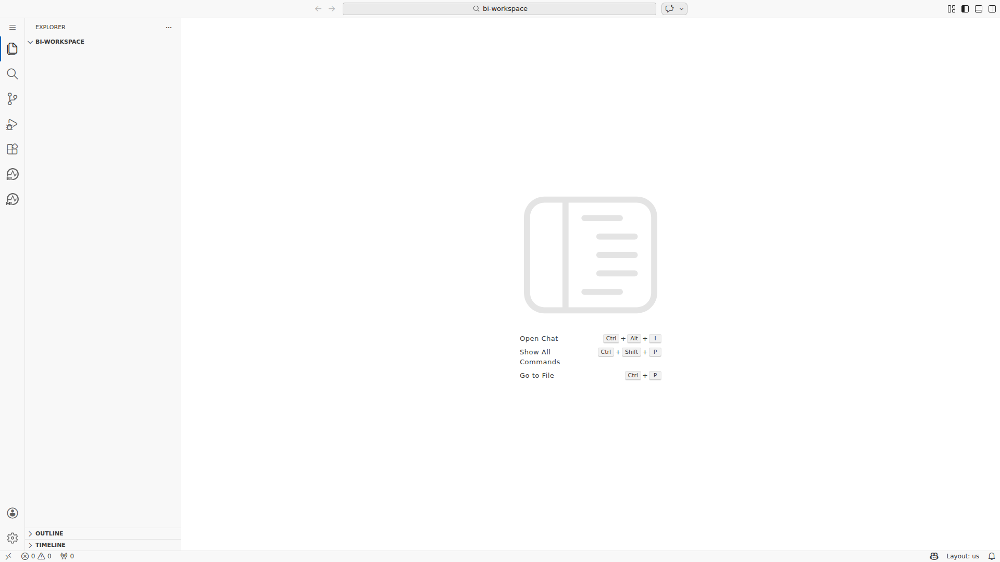

### Step 2 — Open the WSO2 Integrator: BI panel

Click the WSO2 Integrator: BI icon in the Activity Bar (left side bar) to open the BI panel. The panel shows the **Create New Integration** button at the top.

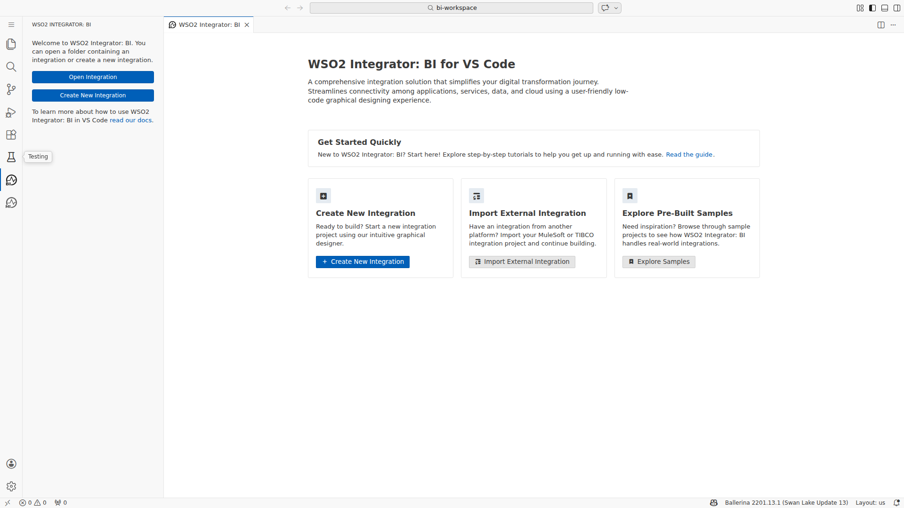

### Step 3 — Create a new integration project

Click **Create New Integration**, enter `snowflake-db-connection` as the project name, select the `~/bi-workspace` directory as the location, and confirm. The low-code canvas opens automatically, showing a blank design surface with the Artifacts panel on the left.

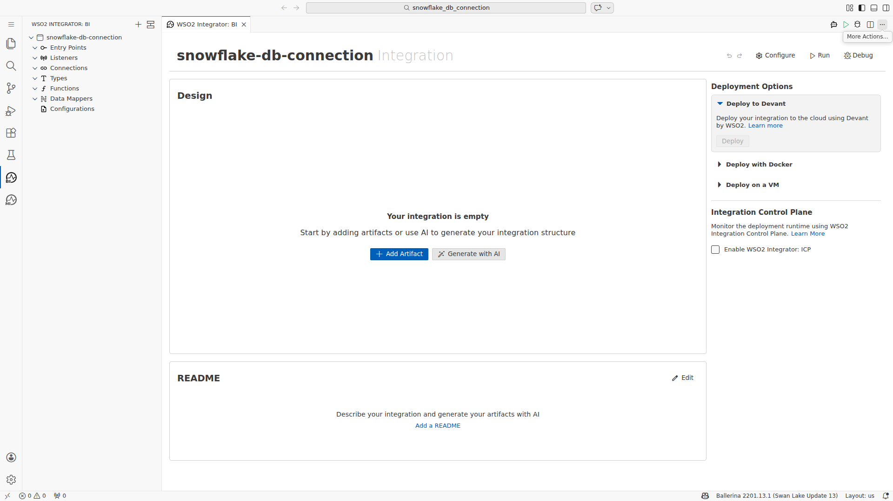

---

## Adding the Snowflake Connector

### Step 4 — Open the Component Palette

In the low-code canvas, click the **+** (Add Component) button or select **Add Connection** from the Artifacts panel to open the Component Palette. The palette displays a search box and a list of available connectors from Ballerina Central.


### Step 5 — Search for the Snowflake connector

Type `snowflake` in the search box. The palette filters the results and displays the `ballerinax/snowflake` connector card published on Ballerina Central.

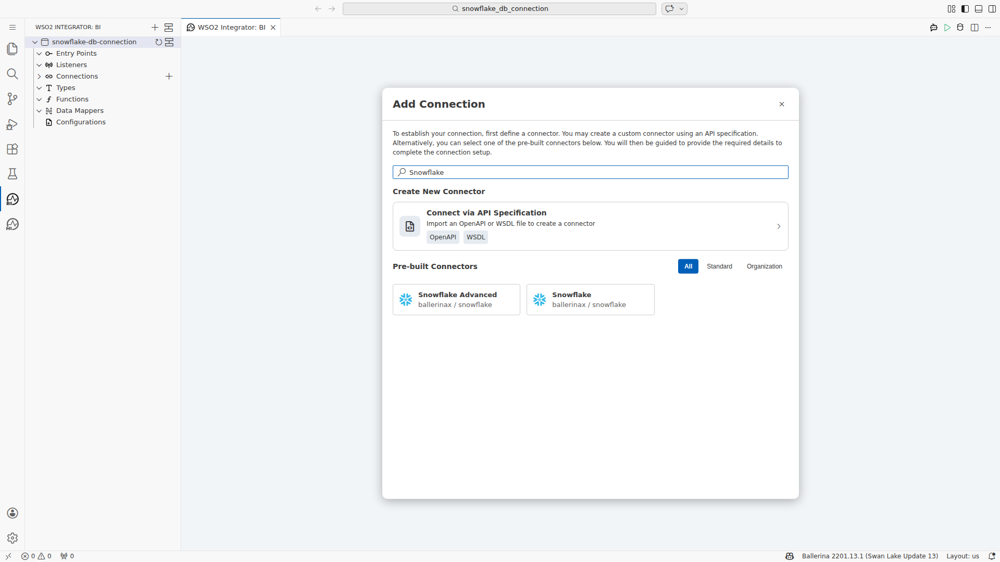

### Step 6 — Add the connector to the canvas

Click the `ballerinax/snowflake` connector card. The **Configure Snowflake Connection** panel slides open on the right side of the canvas.

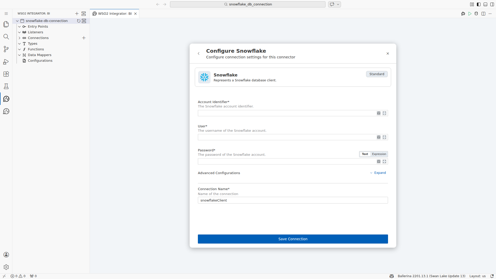

---

## Configuring the Snowflake Connection

### Step 7 — Fill in the connection parameters

Complete all required fields in the Configure Snowflake Connection panel using the values below:

- **Account Identifier:** `myorg-myaccount`
- **Username:** `SNOWFLAKE_USER`
- **Password:** `<your-snowflake-password>`
- **Options (Advanced Configurations):** Click the **Options** field to open the Record Configuration helper, then enter the following expression in the code editor:
  ```
  {properties: {"db": "TEST_DB", "schema": "PUBLIC", "warehouse": "COMPUTE_WH", "role": "SYSADMIN"}}
  ```
  Click **Save** in the Record Configuration panel to apply the value.
- **Connection Name:** `snowflakeConnection`

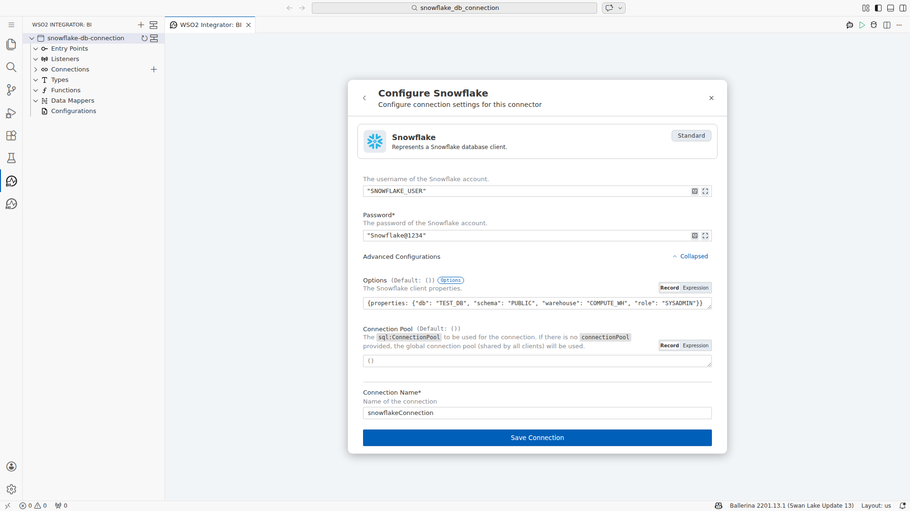

### Step 8 — Save the connection

Click the **Save** button at the bottom of the Configure Snowflake Connection panel. The connection is validated and persisted to `connections.bal`. The canvas refreshes to display the `snowflakeConnection` node in the **Connections** section of the Artifacts panel.

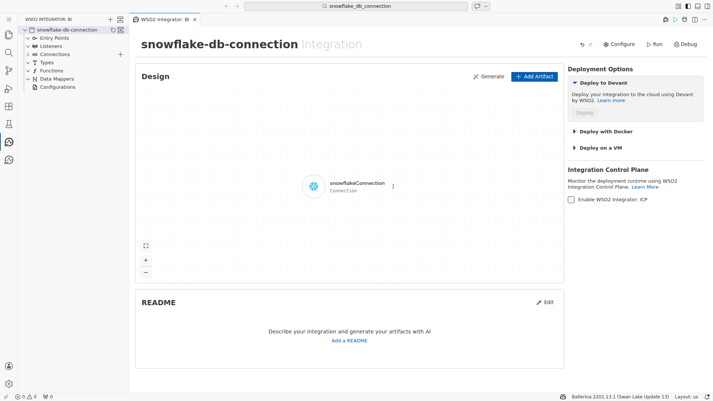

### Step 9 — Verify the connection in the sidebar

The left-side Artifacts tree now lists `snowflakeConnection` under **Connections**. This confirms the `ballerinax/snowflake:2.2.0` module was pulled from Ballerina Central and the client was successfully initialized.

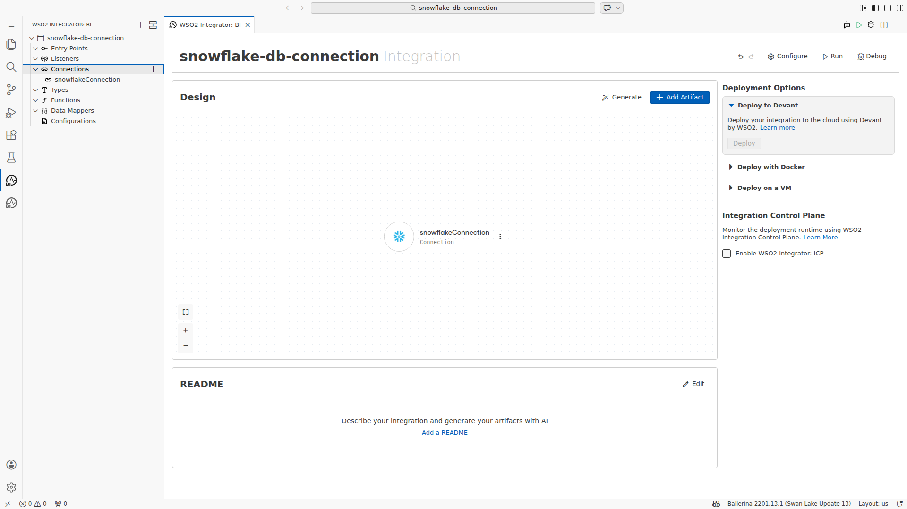

---

## Configuring the Snowflake Execute Operation

### Step 10 — Create an Automation entry point

Click **+** next to **Entry Points** in the Artifacts panel and select **Automation**. The low-code canvas switches to the Automation flow diagram, which shows a **Start** node connected to an **End** node. The `snowflakeConnection` appears in the available Connections list within the flow editor.

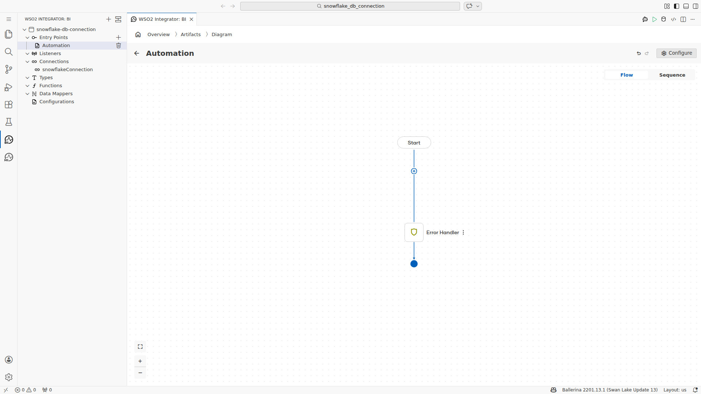

### Step 11 — Add the Execute operation

Click the **+** button between the Start and End nodes on the Automation canvas to open the statement selector. Navigate to **Connections → snowflakeConnection** and expand it. Select **execute** from the list of available operations. The **Execute Operation** configuration panel opens on the right.

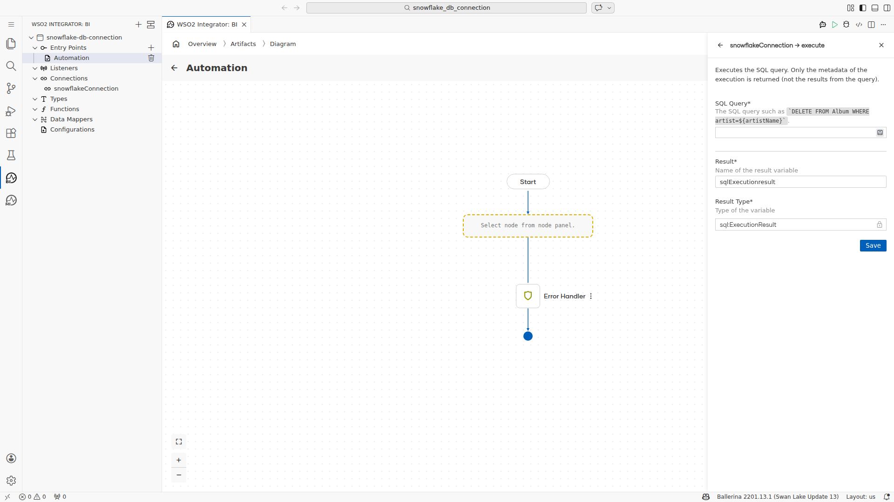

### Step 12 — Fill in the operation parameters

Configure the Execute operation with the following values:

- **sqlQuery:** `` `INSERT INTO test_table (id, name, created_at) VALUES (1, 'test-record', CURRENT_TIMESTAMP())` ``
- **Result Variable Name:** `result`
- **Result Type:** `sql:ExecutionResult`

Click **Save** to confirm the operation configuration.

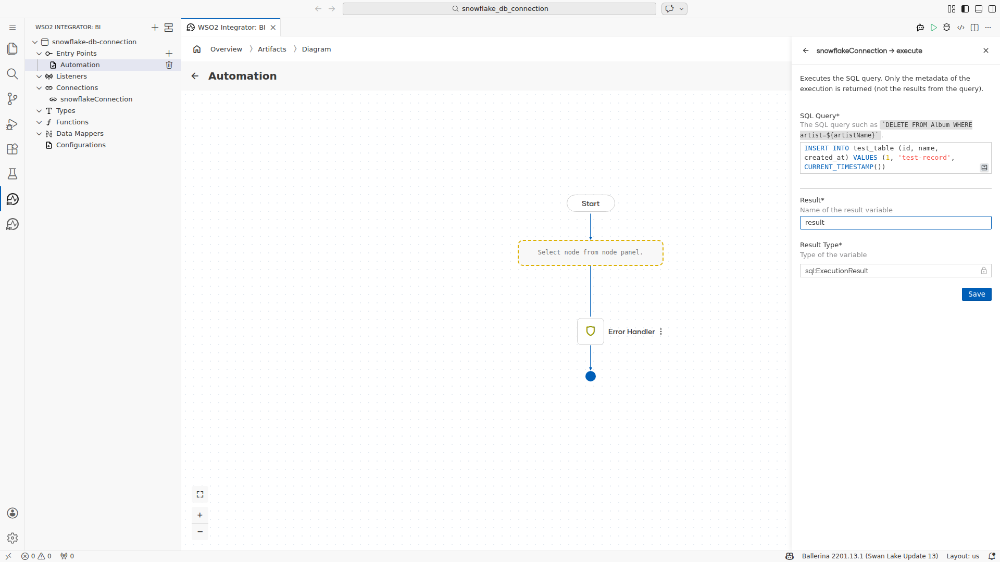

### Step 13 — Verify the Execute node on the canvas

The Automation flow diagram now shows the `snowflake : execute` node inserted between the Start and End nodes. An Error Handler branch is automatically added. The flow reads: **Start → snowflake : execute (result) → Error Handler → End**.

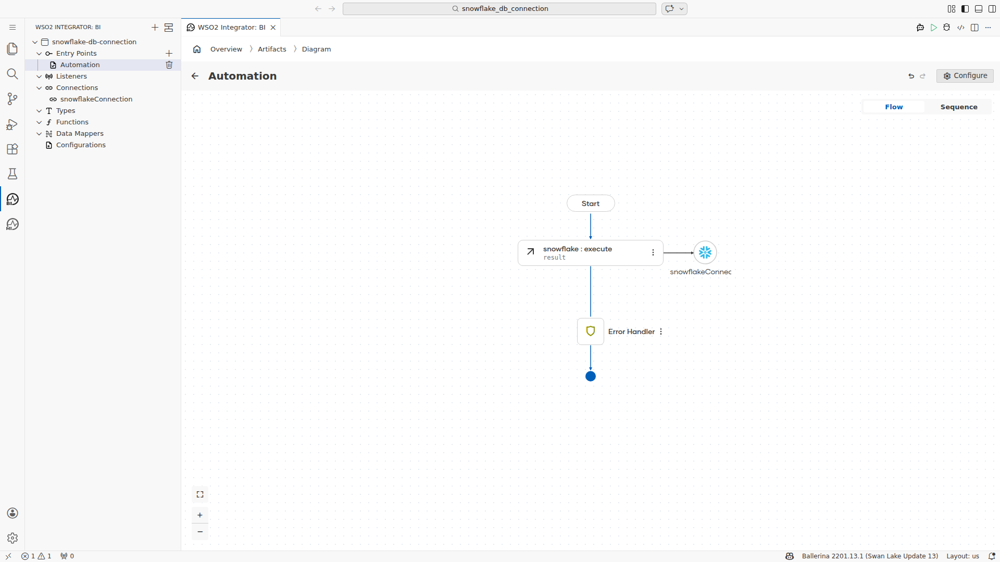

---

## Verifying the Snowflake Integration

### Step 14 — Review the complete integration overview

Navigate back to the integration **Overview** canvas (click **Overview** in the breadcrumb or the Artifacts panel header). The design surface displays both artifacts created during this guide:

- **snowflakeConnection** — Connection artifact (Connections section)
- **Automation** — Entry Point artifact (Entry Points section)

The integration is complete. The `snowflakeConnection` client is initialized with the Snowflake account credentials and advanced options, and the Automation entry point executes an INSERT statement into `test_table` on each run.

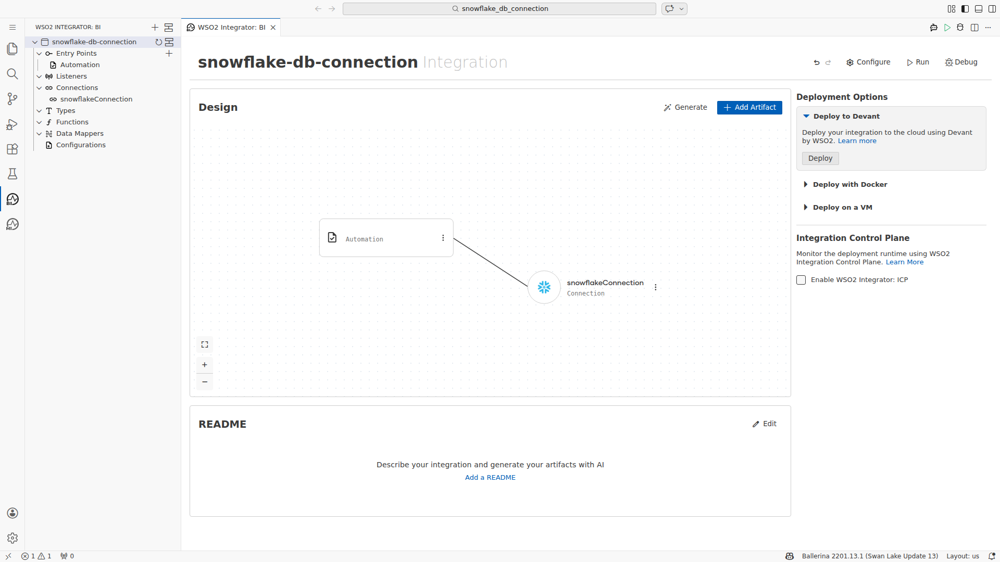
